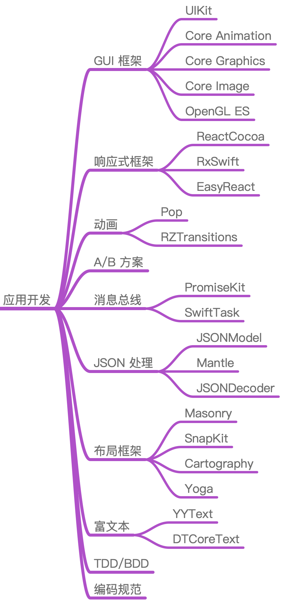

再看看我们身边那些“厉害”角色，他们并不是样样精通，而是有擅长的领域。从我接触的这些“大神”们的成长经历来看，都是先深挖某一领域，经过大量的学习和实践后理解了编程的本质，从而可以灵活调配和运用自己已经积累的知识。在这之后，他们再探索其他领域时，就做到了既快又深，成了我们眼中的“大神”。

**所以，学习 iOS 开发这件事儿，不要一开始就求多，而要求精、求深。因为，条条大路通罗马，计算机的细分领域虽然多，但学到底层都是一样的。**

就比如说，很多 iOS 开发者，刚学会通过网络请求个数据、摆摆界面弄出 App 后，看到人工智能火了就去学一下，区块链火了又去学一下，前端火了又开始蠢蠢欲动。但结果呢？每一门技术都学不深不说，学起来还都非常费劲。

因此，我的建议是**不要被新技术牵着鼻子走，而是努力提升自己的内功，这样才能得心应手地应对层出不穷的各种新技术**。

iOS 的知识体系，包括了基础、原理、应用开发、原生与前端四大模块。我认为好的知识体系首先需要能起到指导 iOS 应用的开发和发现并解决开发问题的作用。所以，这四大模块的设置初衷是：

* 基础模块的作用，就是让你具有基本的发现并解决开发问题的能力；
* 应用开发模块，就是用来指导应用开发的；
* 好的知识体系还要能够应对未来变革，也就是需要打好底子掌握原理、理清规律，看清方向。所以，原理模块的作用就是帮你掌握原理和理清规律，而原生与前端模块会助你看清方向。

接下来，我就为你一一细说这四个模块。

## 基础模块

我把 iOS 开发者需要掌握的整个基础知识，按照 App 的开发流程（开发、调试测试、发布、上线）进行了划分，如下图所示。

我们在**开发阶段**需要掌握的基础知识，主要包括：启动流程、页面布局和架构设计。

* **启动的快慢**，可谓 App 的门面，同时关乎日常的使用体验，其重要性不言而喻。而只有了解了 App 的启动流程，才能合理安排启动阶段对功能初始化的节奏，将启动速度优化到极致。在专栏的基础篇，我会和你一起剖析 App 启动时都做了哪些事儿，让你可以掌控 App 的启动。
* **界面是开发 App 的必经之路**，是一定绕不开的，如何提高界面开发的质量和效率，一直是各大团队研究的重要课题。那么，我在专栏中和你介绍、分析的目前界面开发的趋势，就可以帮你夯实界面这块内容的基础。
* **架构怎么设计才是合理的**，也是这个阶段需要探索的一个重要课题。毕竟每个团队的情况不一样，什么样的架构能够适应团队的长期发展，就是我在这个专栏里要和你好好说道说道的。

在**调试测试阶段**，我们需要掌握的主要就是提速调试和静态分析的内容。

* iOS  开发的代码都是需要编译的。那么，程序体量大了后，编译调试过程必然会变长。而有啥法子能够将这个过程的速度提高到极限，就是我要在这个专栏里面和你分享的了。
* **对 App 质量的检查，分为人工检查和自动检查**。而***质量检查的自动化肯定是趋势***，所以自动化静态分析代码也是这个专栏会讲的。

在**发布阶段**，我们需要做些和业务需求开发无关、涉及基础建设的事情。这部分工作中，最主要的就是无侵入埋点和包大小优化。

* iOS 安装包过大会导致 4G 环境下无法下载的情况，所以对包大小的控制已经成为各大公司最头疼的事情之一。希望我在包大小瘦身上的经验能够帮到你。
* 发布前需要加上各种埋点，这样才能让你充分地掌握 App 运行状态是否健康，同时埋点也是分析上线后遇到的各种问题的重要手段。但是，如果埋点的代码写的到处都是，修改和维护时就会举步维艰。所以我在这个专栏里，也会和你分享一些好的将埋点和业务代码解耦的无侵入埋点方案。

在**上线阶段**，开发质量的高低会影响上线后问题的数量和严重程度，比如有崩溃和卡顿这样导致 App 不可用的问题，也有性能和电量这样影响用户体验的问题。对于这些问题你一定不会袖手旁观，那怎么才能监控到这些问题呢？怎样才能够更准确、更全面地发现问题，同时能够收集到更多有助于分析问题的有效信息呢？

在这个专栏中，我会从崩溃、卡顿、内存、日志、性能、线程、电量等方面和你一一细说。

---

## 应用开发

应用开发部分，我们需要关注的就是一些经典库，因为这些经典库往往出自技术大拿之手，代码结构和设计思想都非常优秀，同时经过了大规模的实践，不断打磨完善，具有很高的质量保障。比如：动画库 Pop，响应式框架 RAC、RxSwift，JSON 处理库 JSONModel、Mantle 等。

有道是**选择大于努力**，可能你使用一个不恰当的库所做的大量努力，也不及别人用对了一个好的库轻轻松松、高质量完成的任务。

---

## 原理模块

说到 iOS 开发原理，主要就是系统内核 XNU、AOP、内存管理和编译的知识。这些知识具有很强的通用性，其他任何语言、系统和领域都会涉及到。

---

## 原生与前端

值得一说的是，从 H5 到 Flutter，渲染底层图形库都使用的是 Skia。也就是说，这么多年来渲染底层技术就基本没有变过。而且，向 Flutter 的演进也只是去掉了 H5 对低版本标准的支持。但，仅仅是去掉这些兼容代码，就使性能提升了数倍。

所以说，**对于新的技术如何去看，很重要，先不要急着深入到开发细节中了，那样你会迷失在技术海洋中。你需要先建立好自己的知识体系，打好基础，努力提升自己的内功，然后找好指明灯，这样才能追着目标航行。**

---

最后，我来把整个专栏中涉及到的基础、原理、应用开发和原生与前端的知识，梳理到一起，就形成了如下图所示的 iOS 知识体系。

