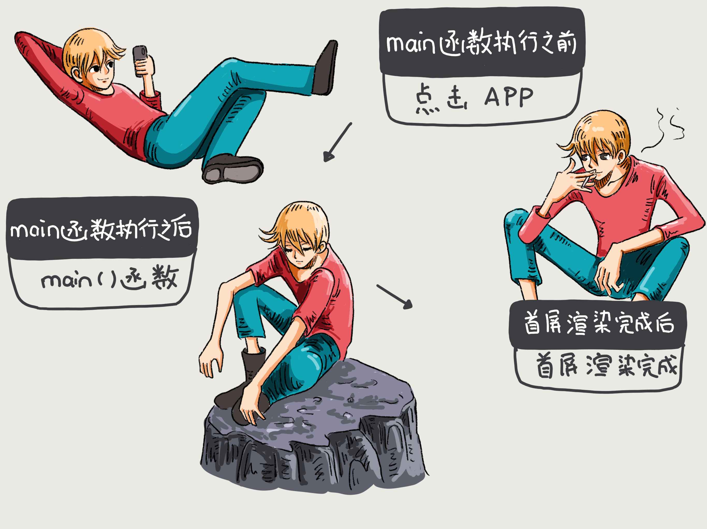

在文章开始前，我们先设想这么一个场景：假设你在排队结账时，掏出手机打开 App 甲准备扫码支付，结果半天进不去，后面排队的人给你压力够大吧。然后，你又打开 App 乙，秒进，支付完成。试想一下，以后再支付时你会选择哪个 App 呢。

不难想象，**在提供的功能和服务相似的情况下，一款 App 的启动速度，不单单是用户体验的事情，往往还决定了它能否获取更多的用户**。这就好像陌生人第一次碰面，第一感觉往往决定了他们接下来是否会继续交往。

---

## App 启动时都干了些什么事儿？

一般情况下，App 的启动分为冷启动和热启动。

* 冷启动是指， App 点击启动前，它的进程不在系统里，需要系统新创建一个进程分配给它启动的情况。这是一次完整的启动过程。

* 热启动是指 ，App 在冷启动后用户将 App 退后台，在 App 的进程还在系统里的情况下，用户重新启动进入 App 的过程，这个过程做的事情非常少。

  

所以，今天这篇文章，我们就只展开讲 App 冷启动的优化。

用户能感知到的启动慢，其实都发生在主线程上。而主线程慢的原因有很多，比如在主线程上执行了大文件读写操作、在渲染周期中执行了大量计算等。但是，有时你会发现即使你把首屏显示之前的这些主线程的耗时问题都解决了，还是比竞品启动得慢。

那么，**究竟如何才能把启动时的所有耗时都找出来呢？解决这个问题，你首先需要弄清楚 App 在启动时都干了哪些事儿**。

一般而言，App 的启动时间，指的是从用户点击 App 开始，到用户看到第一个界面之间的时间。总结来说，App 的启动主要包括三个阶段：

1. main() 函数执行前；

2. main() 函数执行后；

3. 首屏渲染完成后。

整个启动过程的示意图，如下所示：

### main() 函数执行前

在 main() 函数执行前，系统主要会做下面几件事情：

* 加载可执行文件（App 的.o 文件的集合）；
* 加载动态链接库，进行 rebase 指针调整和 bind 符号绑定；
* Objc 运行时的初始处理，包括 Objc 相关类的注册、category 注册、selector 唯一性检查等；
* 初始化，包括了执行 +load() 方法、attribute((constructor)) 修饰的函数的调用、创建 C++ 静态全局变量。

相应地，这个阶段对于启动速度优化来说，可以做的事情包括：

* 减少动态库加载。每个库本身都有依赖关系，苹果公司建议使用更少的动态库，并且建议在使用动态库的数量较多时，尽量将多个动态库进行合并。数量上，苹果公司建议最多使用 6 个非系统动态库。

* 减少加载启动后不会去使用的类或者方法。

* +load() 方法里的内容可以放到首屏渲染完成后再执行，或使用 +initialize() 方法替换掉。因为，在一个 +load() 方法里，进行运行时方法替换操作会带来 4 毫秒的消耗。不要小看这 4 毫秒，积少成多，执行 +load() 方法对启动速度的影响会越来越大。

* 控制 C++ 全局变量的数量。

---

### main() 函数执行后

main() 函数执行后的阶段，指的是从 main() 函数执行开始，到 appDelegate 的 didFinishLaunchingWithOptions 方法里首屏渲染相关方法执行完成。

首页的业务代码都是要在这个阶段，也就是首屏渲染前执行的，主要包括了：

* 首屏初始化所需配置文件的读写操作；
* 首屏列表大数据的读取；
* 首屏渲染的大量计算等。

很多时候，开发者会把各种初始化工作都放到这个阶段执行，导致渲染完成滞后。**更加优化的开发方式，应该是**从功能上梳理出哪些是首屏渲染必要的初始化功能，哪些是 App 启动必要的初始化功能，而哪些是只需要在对应功能开始使用时才需要初始化的。梳理完之后，将这些初始化功能分别放到合适的阶段进行。

### 首屏渲染完成后

首屏渲染后的这个阶段，主要完成的是，非首屏其他业务服务模块的初始化、监听的注册、配置文件的读取等。从函数上来看，这个阶段指的就是截止到 didFinishLaunchingWithOptions 方法作用域内执行首屏渲染之后的所有方法执行完成。简单说的话，这个阶段就是从渲染完成时开始，到 didFinishLaunchingWithOptions 方法作用域结束时结束。

明白了 App 启动阶段需要完成的工作后，我们就可以有的放矢地进行启动速度的优化了。这些优化，包括了功能级别和方法级别的启动优化。接下来，我们就从这两个角度展开看看。

---

### 功能级别的启动优化

而全面治理过程中的手段、方法和碰到的问题，对于后面的规范制定以及启动速度监控都有着重要的意义。那么，我们要怎样从功能级别来进行全面的启动优化治理呢？

功能级别的启动优化，就是要从 main() 函数执行后这个阶段下手。

优化的思路是： main() 函数开始执行后到首屏渲染完成前只处理首屏相关的业务，其他非首屏业务的初始化、监听注册、配置文件读取等都放到首屏渲染完成后去做。如下图所示：

### 方法级别的启动优化

经过功能级别的启动优化，也就是将非首屏业务所需的功能滞后以后，从用户点击 App 到看到首屏的时间将会有很大程度的缩短，也就达到了优化 App  启动速度的目的。

在这之后，我们需要进一步做的，是检查首屏渲染完成前主线程上有哪些耗时方法，将没必要的耗时方法滞后或者异步执行。通常情况下，耗时较长的方法主要发生在计算大量数据的情况下，具体的表现就是加载、编辑、存储图片和文件等资源。

那么，你觉得**是不是只需要优化对资源的操作就可以了呢？**

当然不是。就像 +load() 方法，一个耗时 4 毫秒，100 个就是 400 毫秒，这种耗时用户也是能明显感知到的。

比如，我以前使用的  ReactiveCocoa 框架（这是一个 iOS 上的响应式编程框架），每创建一个信号都有 6  毫秒的耗时。这样，稍不注意各种信号的创建就都被放在了首屏渲染完成前，进而导致 App 的启动速度大幅变慢。

---

类似这样单个方法耗时不多，但是由于堆积导致  App  启动速度大幅变慢的方法数不胜数。所以，你需要一个能够对启动方法耗时进行全面、精确检查的手段。

那么问题来了，有哪些监控手段？这些监控手段各有什么优缺点？你又该如何选择呢？

目前来看，对 App 启动速度的监控，主要有两种手段。

**第一种方法是，定时抓取主线程上的方法调用堆栈，计算一段时间里各个方法的耗时**。Xcode  工具套件里自带的 Time Profiler ，采用的就是这种方式。这种方式的优点是，开发类似工具成本不高，能够快速开发后集成到你的 App  中，以便在真实环境中进行检查。

**第二种方法是，对 objc_msgSend  方法进行 hook 来掌握所有方法的执行耗时。**

hook  方法的意思是，在原方法开始执行时换成执行其他你指定的方法，或者在原有方法执行前后执行你指定的方法，来达到掌握和改变指定方法的目的。

hook  objc_msgSend 这种方式的优点是非常精确，而缺点是只能针对 Objective-C 的方法。当然，对于 c 方法和 block  也不是没有办法，你可以使用 libffi 的 ffi_call 来达成 hook，但缺点就是编写维护相关工具门槛高。

关于，libffi  相关的内容，我会在后面的第 35 篇文章“libffi：动态调用和定义 C  函数”里和你详细说明。

综上，**如果对于检查结果精准度要求高的话，我比较推荐你使用 hook objc_msgSend  方式来检查启动方法的执行耗时**。