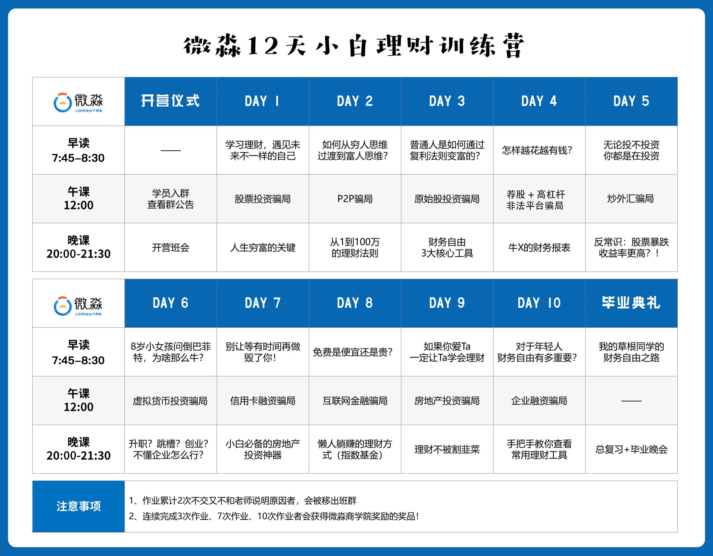
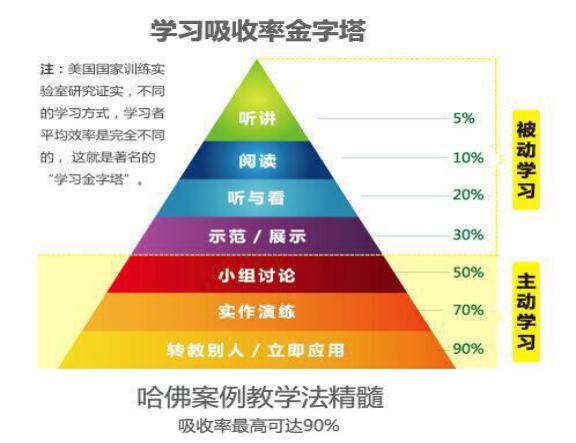
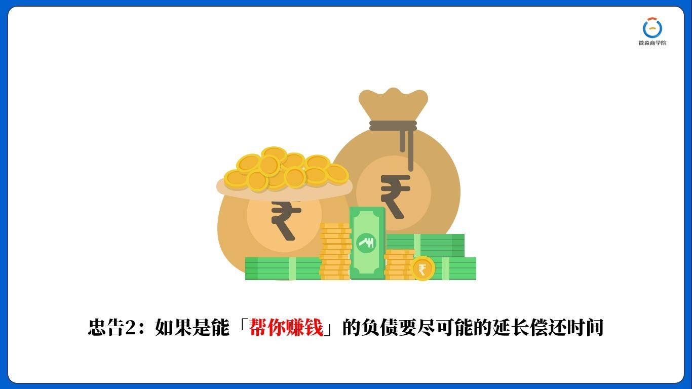
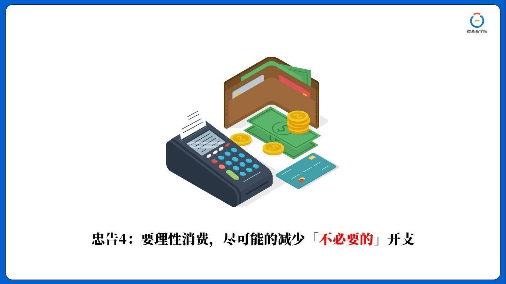
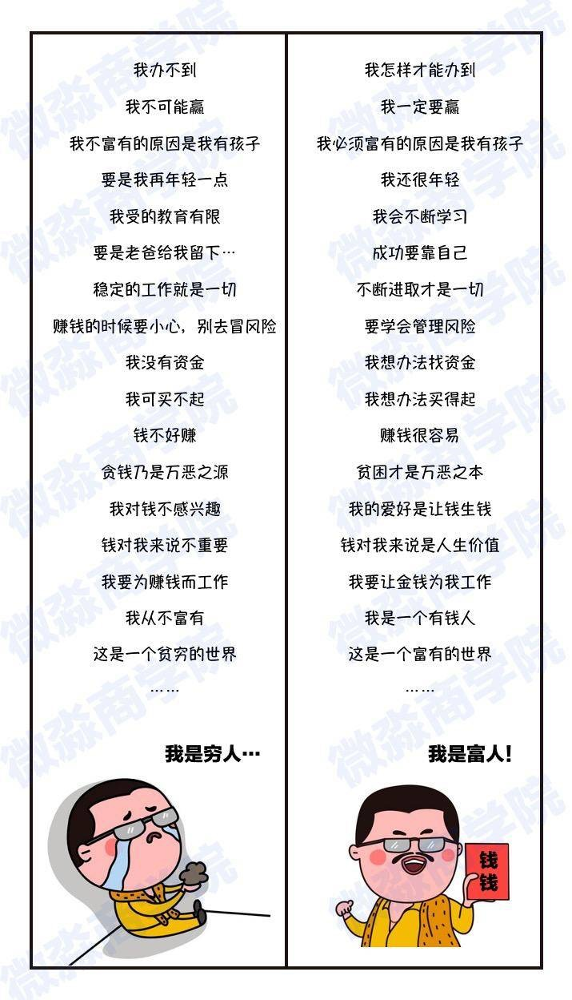
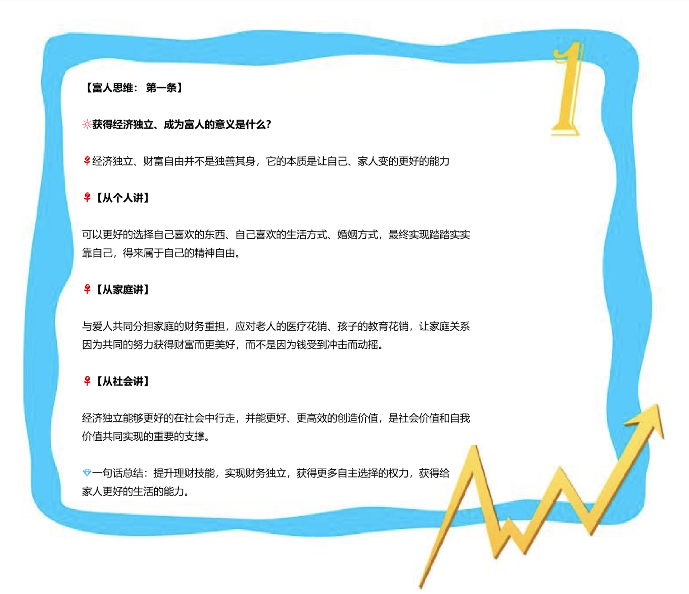
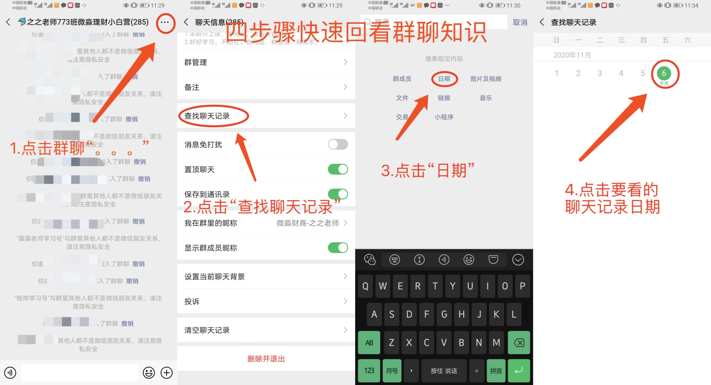

<video id="video" controls="" preload="none">
    <source id="mp4" src="./picts/chapter1/1606728249055672.mp4" type="video/mp4">
</video>


《富爸爸穷爸爸》作者罗伯特清崎采访的视频，财务自由思想在90年代掀起了浪潮，真的是说出了财富的秘密，这个视频的认知如果不知道，一辈子都不知道自己那么努力错在哪了，所以大家一定要认真看。



这是咱们这12天的课程表，今天晚课是开营班会。


---



我们看这个学习吸收率金字塔，只有听讲、阅读、听与看，吸收率是非常低的，这些都是被动学习。

我们只有主动学习，讨论、演练、转教给别人，时间才能达到很高的吸收率。


---

有的同学说，为什么我交了钱，还要让我做作业，真是岂有此理。

老师来给大家解释一下为什么会有这样的设置。

💻网络教育的一个弊端就是无法约束学员，任何的自律都有一定程度的他律，而训练营的这种方式就是一定程度的他律。

♻️光听课不做作业，这种没有任何输出形式的学习是低效的；

♻️作业是一种梳理的过程，只有完成作业，才能更好地掌握知识；

⚠决定一个人上限的不仅仅是智商和财商，更重要的是“自律”希望大家都能主动性的思考学习，而非传统填鸭式的灌输。


<video id="video" controls="" preload="none">
    <source id="mp4" src="./picts/1606743814278965.mp4" type="video/mp4">
</video>


钱和黄金脱钩后，世界各国便开始设立了自己的中央银行，这个中央银行通过【信用】控制着一个国家钱的总量。

国家经济是一直向前发展的，那么这就需要钱的总量一直增加🚀。同样经济落后，国家也会多印点钱来刺激经济发展。

>  ⚠注意：钱和黄金挂钩的期间，钱的总数是有上限的，不存在通货膨胀这个东东，钱只会紧缺，不会有过剩贬值这一说。

而脱钩后的钱，没有了通用标准，是可以根据国家信用凭空产生。


大家一定要明白，攒钱是最愚昧的积累财富方式，我们一定要想办法增加优质资产！💪


---

该怎样防范或化解债务问题呢？

### ✅第一条：尽可能的消除因「消费」产生的负债。


消费产生的支出大多是“坏支出”会持续的带走现金流，让你在债务泥潭中越陷越深，越来越穷，最终陷入财务危机之中⚡


因为负债也分为【好负债和坏负债】

如果是能带来钱生钱，获得更高收益的，就是【好负债】

如果不断的流出的，没有流入资金的负债，就是【坏负债】

💔坏负债越多，人就会越穷。

❤好负债越多，人就会越富。


### ✅第二条：能“帮你赚钱”的好负债要尽可能的延长偿还时间




👉我来给大家举一个例子：

假设你从银行贷款30万，年利息6%，你会好的理财技能，然后你30万投资的年化收益率20%，那么这30万就是你的好负债。

相反，你要用这30万买了辆车、买了手表、买了包包，每个月消耗自己还账，那这30万就是【坏负债】


### ✅第三条：要消除消费贷款，多存钱，来购买生钱资产



存钱就是养鹅，鹅养肥了它就可以下金蛋。没有鹅的人是没有金蛋收的，是不能富有的。

【理财收入】也叫【非工资收入】或者是【睡后收入】，就是不占用时间精力也能获得的收入。


### ✅第四条：要理性消费，尽可能的减少“不必要”的开支


如果你仔细分析一下自己每个月的消费支出，你会发现有三分之一甚至更高的支出都是不必要的【坏支出】

所以要理性消费，减少不必要的支出，尽快把自己下金蛋的鹅养肥💰。

今后再面对非理性消费的时候，要先问自己一句话：**“这真的有必要吗？？？”**


---

这里我要强调一下会下金蛋的【鹅】之前看过一个故事让我印象非常深刻。

一个农夫有1只会下金蛋的鹅，农夫开始很高兴，后来农夫的欲望越来越大，鹅下金蛋的速度赶不上农夫欲望膨胀的速度。于是农夫就杀鹅取卵，最后鹅没了，金蛋也没了，农夫又变成了当初的穷光蛋💔

该怎么做呢？ 👇

⭐️一部分储蓄起来养鹅；
⭐️一部分放在梦想储蓄罐；
⭐️一部分日常开销；

---

在现实生活中，很多人往往因为控制不了自己的消费欲望而杀死自己的鹅。

> ⚠老师并不反对大家去买好东西，更不反对追求高品质的生活，但是你应该用鹅下的金蛋去买，而不是杀死自己的鹅去买。

---

继续说回来，从负债到梦想储蓄罐到养鹅，财商升级需要经历三个历程：

⭕第一层次：**控制不住消费欲望**，为了新出的包包、鞋、电脑就要花光自己所有的钱。

⭕第二层次：**建立自己的储蓄罐**，为了自己的梦想开始运用自己的优势来赚钱、存钱，但暂时没有自己的鹅。

⭕第三层次：**开始养“鹅”生“金蛋”形成良性循环，越养越肥**。

看完后大家可以说说，自己现在都处于上面哪个层次呢？


通过以上结论，我们可以看出，你目前的财务状况其实是一种“结果”。富有也好，负债也罢；往往并不是原因。什么才是贫穷的原因呢？【思维】才是贫穷最根本的原因。

<video id="video" controls="" preload="none">
    <source id="mp4" src="./picts/1606746173817352.mp4" type="video/mp4">
</video>


---

如果你具备的是固化的“穷人思维”即便你突然有了很多钱，这笔钱也会离你而去💔

一名叫卡罗尔的 26 岁英国男子 2002 年中了乐透大奖，从一名默默无闻的垃圾收集工成为亿万富翁。突如其来的大笔财富让他心智大变。他要把受过的穷、吃过的苦、看过的脸色全都补回来。当时他一下送了 500 万给亲朋好友。2003 年，他开始吸毒，当年妻子和他离婚，带着女儿离开了他，后来他又开始疯狂的嫖娼和赌博。直到 2010 年，仅仅 8 年时间，吸毒、嫖娼、赌博，妻离子散，他的这笔财富已挥霍一空，自己不得不重回做苦力活的阶段。他已经一贫如洗，甚至变得比中奖前还要贫穷 💔

当一切回到原点，卡罗尔说，“派对结束了，是回到现实的时候了。我发现靠着 42 英镑救济金生活比拥有百万财富要“容易”得多。


**真正的财富，并不会因为突然有了一大笔钱而彻底改变**，如果不具备“钱生钱”技能，再多的钱也是过眼云烟，迟早清零💔

而成为富人跟自己的出身、本金、学历、年龄、职业、运气等没有必然因果关系。

💎世界富豪洛克菲勒先生曾说过这样一段话：即便有一天把我丢到沙漠里，让我我身无分文，只要让我看到经过的商队，用不了多久我又会成为一个富翁。

<video id="video" controls="" preload="none">
    <source id="mp4" src="./picts/1606746317850997.mp4" type="video/mp4">
</video>


---

那什么是穷人思维？

什么是富人思维呢？

给大家1分钟时间，看一下这张穷人和富人思维的对比图，建议同学们保存到手机里。



穷人不断的找理由：我不行、我做不到、我配不上、太难了....

富人不断的找方法：我怎么能行、需要怎么做、我一定可以....

记着：只要你肯努力，并且是正确的方向一定可以。


❗❗ 最可怕的是：

大多数穷人是意识不到自己“穷人思维”的，不愿意打破“舒适圈”认为自己什么都懂，宁可抱怨自己运气不好，也不愿意寻求认知上的改变，正是这种思维局限性，才是他们一生都难以变富有的深层次原因！

不夸张的说，理财是每个人一生中【必修】的一门课程


---

### 🎤接下来大家讨论一下，获得经济独立、成为富人的意义是什么？

🌹经济独立、财富自由并不是独善其身，它的本质是让自己、家人变的更好的能力。

🌹【从个人讲】

可以更好的选择自己喜欢的东西、自己喜欢的生活方式、婚姻方式，最终实现踏踏实实靠自己，得来属于自己的精神自由。

🌹【从家庭讲】

与爱人共同分担家庭的财务重担，应对老人的医疗花销、孩子的教育花销，让家庭关系因为共同的努力获得财富而更美好，而不是因为钱受到冲击而动摇。

🌹【从社会讲】

经济独立能够更好的在社会中行走，并能更好、更高效的创造价值，是社会价值和自我价值共同实现的重要的支撑。


🌹一句话总结：提升理财技能，实现财务独立，获得更多自主选择的权力，获得给家人更好的生活的能力。




## 作业

自我介绍。

【财富目标】就是需要用钱才能去完成的事情.

目标是具体的事情，并需要【用数字具体量化金钱价值】，需要大致多少钱可以实现，以及量化完成的时间。

⭕比方说：

什么时候还清多少的债务？
工资、非工资收入达到多少？
哪一年买车？买房？
旅游储备金、保险计划？
下一代的教育金、上一代的养老金等等
。。。。。。。。。

**好的目标，要【量化】到具体的数字，要有：时间，金钱，事情，三要素**

示范：

```
【姓名】：云叶老师
【地区】：天津
【年龄】：31岁
【职业】：财商教育老师
【理财经验】：4年，股票，股票指数基金，年化收益率30%+
【可支配月收入】：6.5万
【个人可用资金】：七位数
【债务】：房贷
【4个最重要的财富目标】：
1、尽自己最大努力帮助更多的人，让更多人和我一样，在困境的时候可以有人伸出手拉他们一把，实现自己的人生价值，让更多的同学能有机会走向财务自由的道路。
2、让父母不再为钱发愁，把他们接到身边，单独给他们买一套房子，休息时就可以带着父母出去旅游。
3、通过自己的言传身教提高孩子的财商，协助孩子在22岁前实现财务自由。
4、尽全部努力帮助微淼几年内上市，成为全球最好的财务自由实现平台！！
```

自我介绍模板如下：

```
【姓名】：
【地区】：
【年龄】：
【职业】：
【理财经验】：
【可支配月收入】：
【个人可用资金】：
【债务】：
【3个最重要的财富目标】：
1.
2.
3.
```


工作有工作的目标，学习有学习的目标，同样变富也要有目标，有了目标我们才能知道前进的方向在哪里。



👆每天上完课再复习一次，迟到爬楼的同学也可以按照下图的方法爬楼复习。