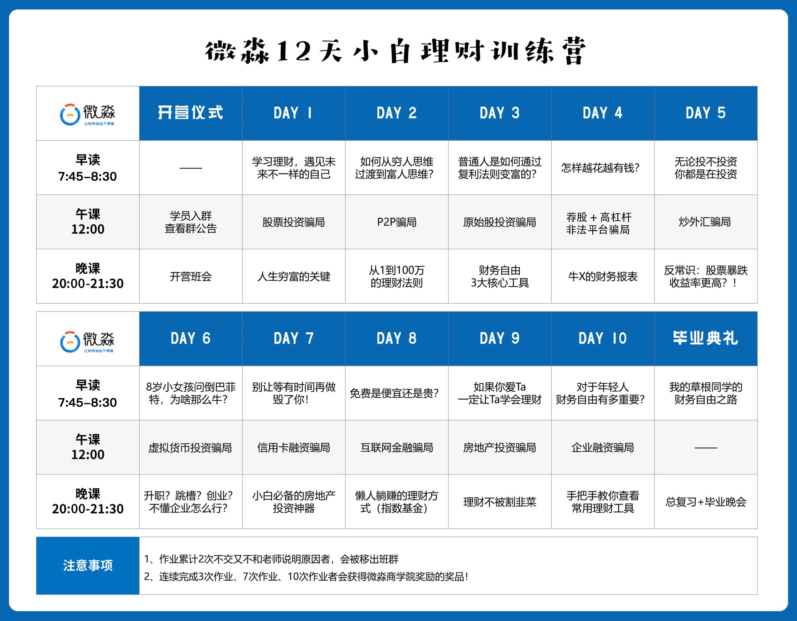
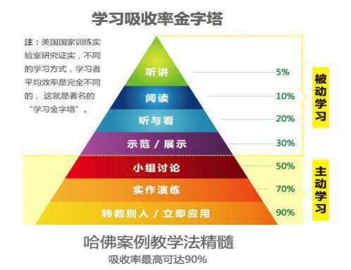

<video id="video" controls="" preload="none">
    <source id="mp4" src="./picts/1606728249055672.mp4" type="video/mp4">
</video>

《富爸爸穷爸爸》作者罗伯特清崎采访的视频，财务自由思想在90年代掀起了浪潮，真的是说出了财富的秘密，这个视频的认知如果不知道，一辈子都不知道自己那么努力错在哪了，所以大家一定要认真看。

这是咱们这12天的课程表，今天晚课是开营班会。

---

我们看这个学习吸收率金字塔，只有听讲、阅读、听与看，吸收率是非常低的，这些都是被动学习。

我们只有主动学习，讨论、演练、转教给别人，时间才能达到很高的吸收率。