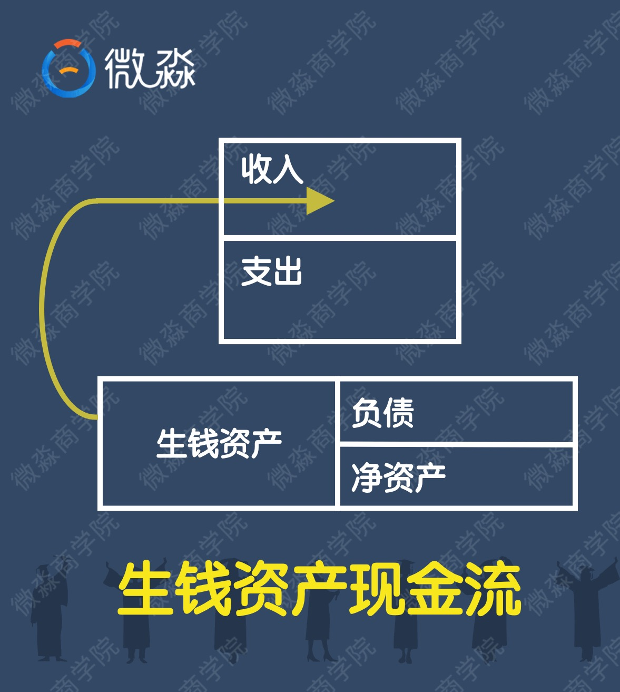
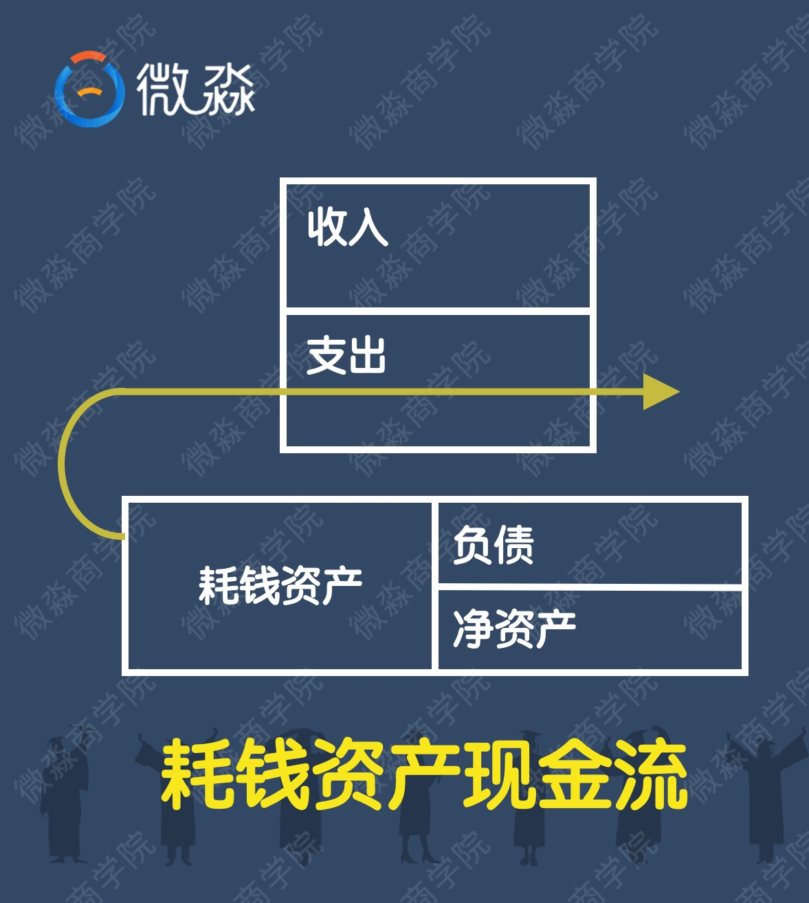
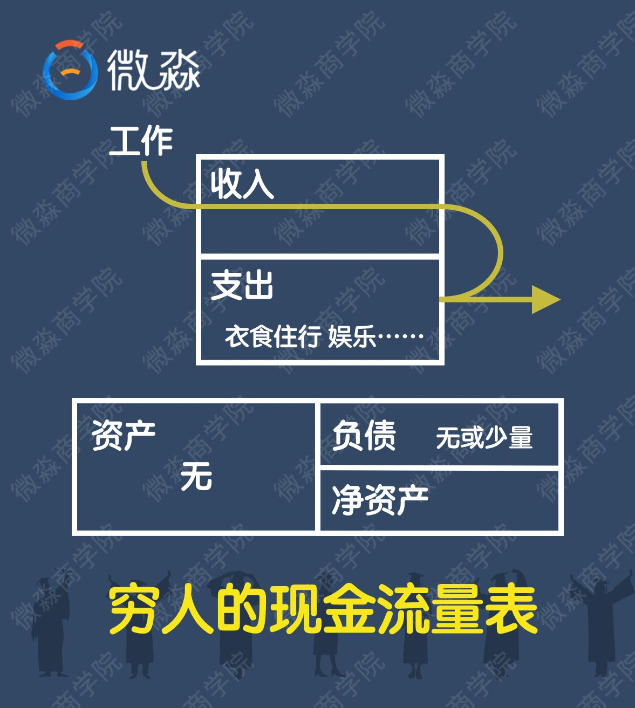
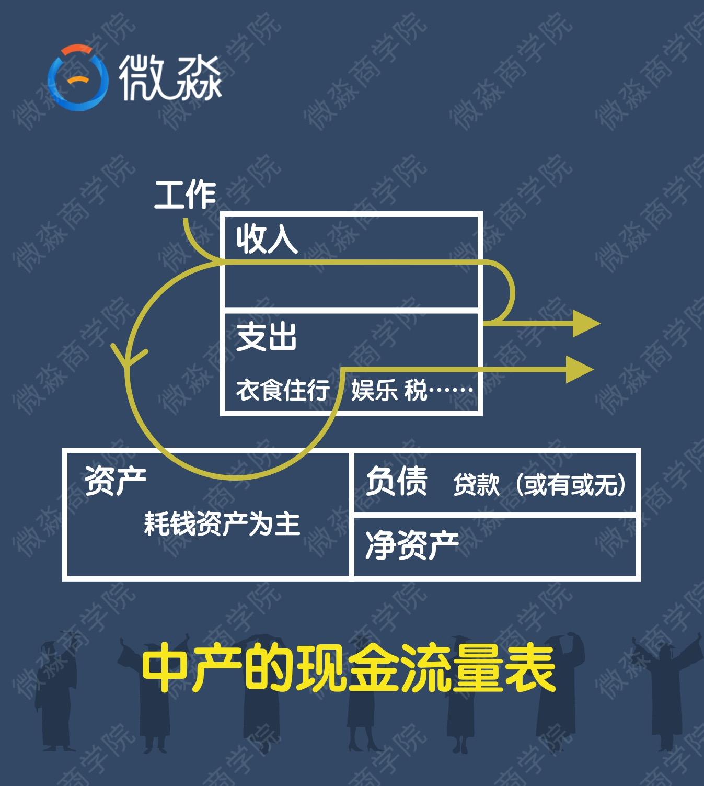
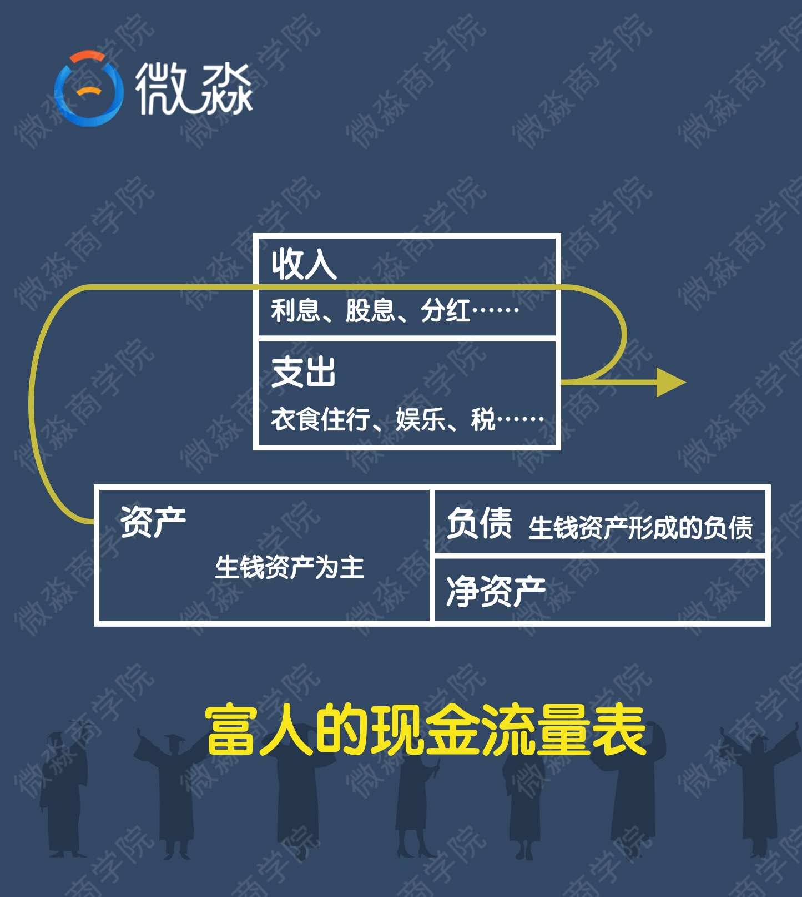

很多人吧投资和理财误以为是一件事，其实不是。投资知识理财的一部分，理财是一个很广泛的概念。比如制定家庭日常消费计划、投资计划、保险计划、教育金计划、养老金计划等等都是理财中的一部分。**凡是涉及到跟钱有关的安排，都是理财。**

富不过三代。为什么会这样呢？到底是什么决定了人是穷富？人生穷富的关键是什么？

这就是我们今天要学习的重点——生钱资产和耗钱资产。**生钱资产、耗钱资产也是理财中最最重要的概念。穷人之所以穷，富人之所以富的关键就在这两个资产。**

什么是资产？资产就是一切可以以货币计量的东西。

会计上吧资产是否方便变现分为流动资产和非流动资产。其实这个会计上的划分对于投资理财一点帮助都没有。这是因为资产的赚钱能力和资产的变现能力几乎没有半毛钱的关系。

资产的内涵是什么呢？**资产的内涵是现金流。敲黑板，资产的内涵是现金流。**

---

资产产生现金流的不同就决定了资产的不同。根据资产产生现金流的不同，可以把资产分成3种。

* 生钱资产：

能给你程序带来净现金流入的东西。有了生钱资产，你就可以躺着数钱了。这就是所谓的睡后收入。生钱资产养人呐。

* 耗钱资产：

能给你程序带来净现金流出的东西。有了耗钱资产，你躺着的时候还在付钱。这就是所谓的睡后支出。耗钱资产需要被人养。耗钱资产耗人啊。

* 其他资产：

产生的净现金流为0的东西。有了其他资产，你躺着的时候你就是在躺着。

---

那你怎么变富呢？

**要想富有你只要不断买入生钱资产就好啦。同样如果你想变穷，只需不断的买入耗钱资产就可以了。**

那么有钱人是怎么变穷的呢？为什么不能富过三代呢？

因为他们不断买入耗钱资产或者不断增加坏支出。

---

生钱资产和耗钱资产的现金流：

---

穷人、富人、普通人的生钱资产和耗钱资产情况如何呢？

低收入人群现金流：

一般而言，低收入群体的工作收入是偏低的，对于低收入人群来讲，他的工资应付完各种支出，也没有什么结余去买生钱资产或者耗钱资产了。

**穷人，或者说处于穷人状态的人群，应该怎么办捏？**

如果你的收入偏低，没有结余，一是要分清必要开支和不必要开支。

必要时没有这件东西你的生活会受到重大影响，不必要仅仅是有了会开心。要控制自己的支出，强制储蓄来养鹅。

第二点就是要开源咯，好好提高工资收入。

**刚开始的时候投资自己是最好的投资！提升个人技能，摆脱穷人思维，投资自己的大脑，提高工资收入~**

**一般建议刚毕业或者30岁以前，多花些时间在工作技能提升上面。**

有人说，我的工资收入已经在1万以上了，后期工资提升的水平已经很有限啦，要再升职加薪没那么容易怎么办？

这时候我们就需要重点增加自己的非工资收入了。

---

工资收入就是自己付出时间、精力、汗水挣来的钱。

非工资收入就是，你不需要去劳动也能有收入。

我们都应该两手都要抓，两手都要硬。这是最理想的状态啦，相对来说，理财投资还是门槛较低的。

---

「我还是先提高工资收入吧，等有钱了在学习理财技能。」

这样是不对的，如果只靠工资收入来攒钱，你很可能到退休了还没有攒够理财的本金。因为靠工资攒钱是最低效最差的方式。**聪明的人会在获得第一笔工资收入时就开始选择合适的理财工具来积累自己的本金和非工资收入了。**

聪明的人从一开始就通过工资和非工资收入两条路径来增加自己的收入。两条腿走路肯定比只靠工资收入一条腿走的更快更远。

---

**普通人或者说中产阶级的现金流**：

中产把工资收入变成了耗钱资产，耗钱资产不停消耗中产的钱。为了养耗钱资产，中产是不能停止工作的。由于耗钱资产的存在，中产几乎是很难变富有的。

通过调查我们发现，遭遇财务危机的往往是那些职业和收入看起来还不错的人！为什么呢？

收入良好的人，很多也不会打理财富，觉得自己的钱够花，其实造成的浪费和产生的耗钱资产也更多更大。他们通常还以为自己买了生钱资产，实际上他们的钱并没有流向真正的生钱资产。

很多时候中产的现金流比穷人更糟糕。大部分穷人是没有耗钱资产的，也没有负债。因为既买不起耗钱资产，也借不到钱。而中产却有耗钱资产，也或多或少会有负债。耗钱资产和负债都会不停消耗中产的现金。一旦收入出现问题，现金流就容易断裂。调查发现，中国香港、日本房地产崩盘的时候，跳楼的基本都是中产。

---

富人的现金流：

**富人的收入主要来自生钱资产，生钱资产产生的现金流入完全能够覆盖各种支出。富人不用为了生活而去工作。这样就可以好好的去嗨皮了。所以我们常能看到一些关于富人的负面报道。因为有更多的时间去嗨皮所以偶尔会干些出格的事情。更重要的是，富人不干活还那么有钱。**

**富人的第一个秘密：生钱资产占总资产80%以上。大家要记住这个比率。**

相对应的穷人的第一个死穴：毫无任何生钱资产可言！生活唯一的经济支柱就是工资！

**富人的第二个秘密：好支出占总支出的80%以上。大家要记住这个比率。**

对富人来说，支出是有好坏之分的。好支出是可以带来更多收入的支出。比如花钱买”生钱资产“，这种支出能为你带来持续的净现金流入；花钱学英语，这种支出能增加你后期的工资收入；花钱学理财，这种支出在未来会获得非工资收入。这些支出都是好支出。所以富人的钱越花越多！

坏支出是让你的钱变的更少的支出。

相对应的，穷人的第二个死穴：不知道支出也分好坏！怀指出占了总支出的80%以上。

**以上是富人的两个秘密，大家一定要了解清楚哈，这个非常重要！**

---

另外富人和穷人的主要不同，就是对待新鲜事物的态度。

富人乐于接受新鲜度十五，并在不断增长见识的过程中，提升自己辨别事物的能力，同时结交更多的朋友，拓展自己的圈子，遇到更多的贵人，进而良性循环！

而穷人对于任何新鲜的事物，第一反应就是屏蔽，或者说是封闭自我。

穷人思维比没有钱更可怕。

人的穷富，其实首先取决于你的观念，而不是你的财产本身！

有了正确的观念，其实技巧都不难学会；但是观念错误，即便你有钢铁侠的装备，也不过是在错误的道路上飞奔而已。

《富爸爸，穷爸爸》中，富爸爸常常这样说：”富人不会这样做“。因此，**在思想上”脱贫“是走向财务自由的第一步。**

因此我首先要告诉大家一个观念：财富是理出来的，没钱更需要理财！财务自由是科学理财后的必然结果。上班越忙越需要财务自由。

---

**财务自由就是：你的非工资收入能够覆盖掉你的日常支出。**

这里还涉及到一个财务自由度的概念：

计算公式为：$财务自由度= \dfrac{年非工资收入（年投资收入）}{年生活支出}$ 。

一般等于1是最基本的自由度，数字越大，代表自由度越高。

---

温馨小贴士：

1. 如果你计划买房子，建议买生钱资产的房子。
2. 努力去思考一下你可以买什么样的生钱资产？可以去如何提升自己？
3. 对于零基础同学来说，可以先培养投资和理财的理念，再了解各种投资品，然后再进一步学习，之后再去完善好家庭的生钱资产配置。

---

---

---

<video id="video" controls="" preload="none">
    <source id="mp4" src="./picts/1606813334068660.mp4" type="video/mp4">
</video>

看完小视频，我们也思考一下为什么我们不能沉溺于工作，仅凭“工资收入”的生活，财务安全吗？

⭐每天的晚课都是“重头戏”尤其是今天晚课是整个小白营的基石，想学好赚钱技能，一定要付诸于行动💪