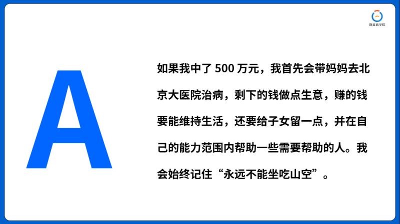
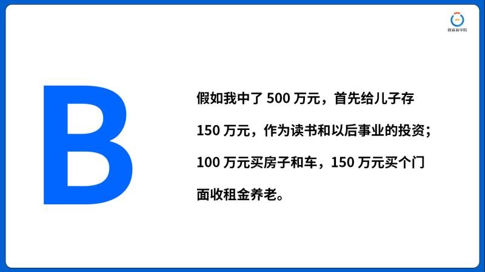
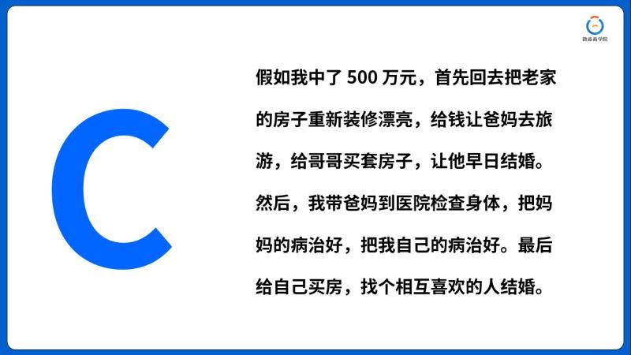
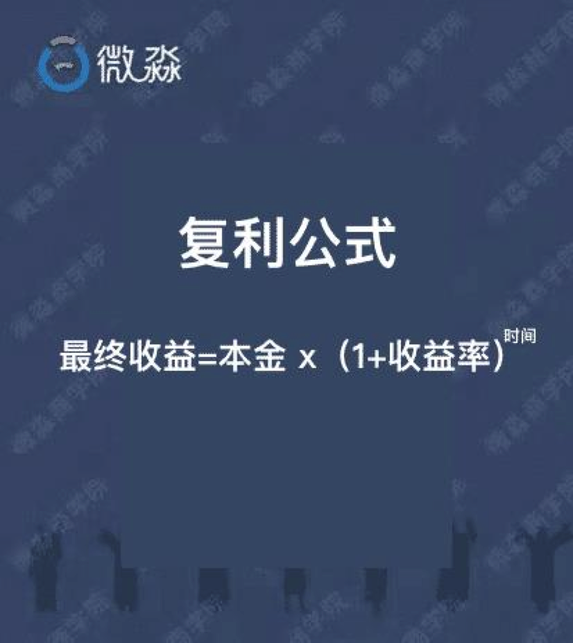
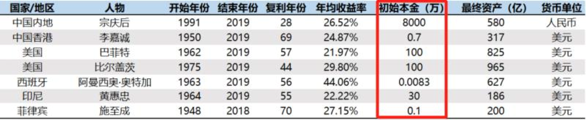
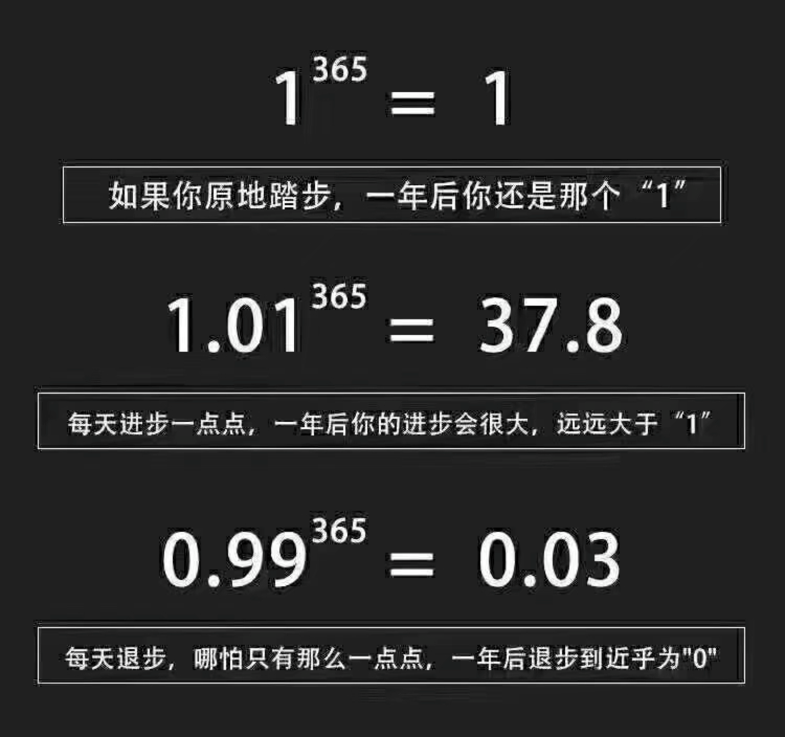
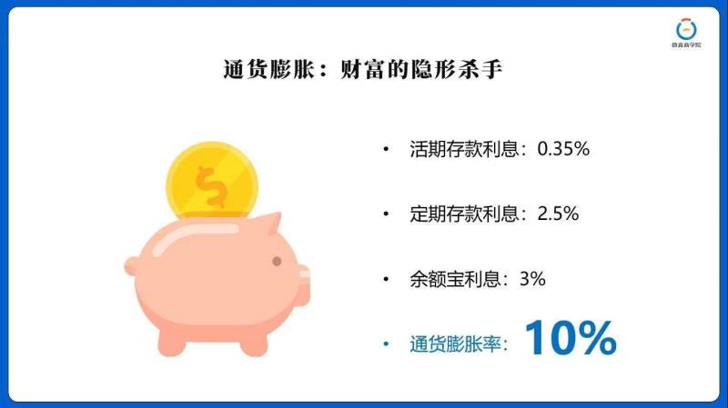
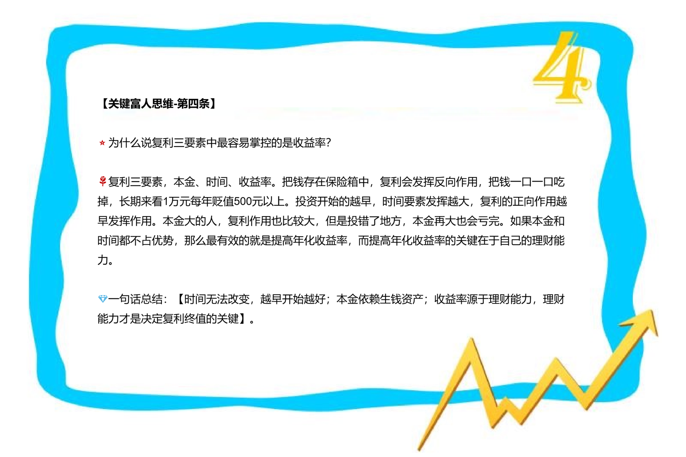
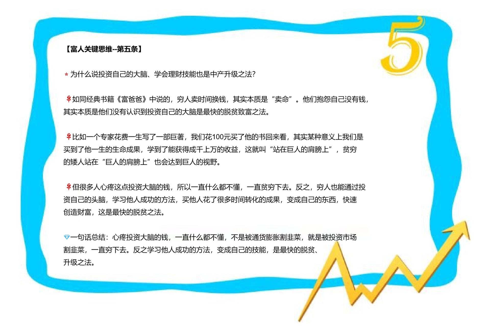

# 投资学【第2课】《复利法则》

下面给大家3个选项，大家仔细看完后，说说谁最有可能实现财务自由？

正确答案👇

【B】财务自由
【A】中产
【C】返贫

我们看一下选择题的理由：

【B】投资了门面，通过收租金的形式持续获得现金流💰租金收入大于生活支出，他持有的是生钱资产，不用工作，实现了财务自由🤗

【A】把钱用来维持生活、存着留给子女、帮助别人、再做点生意。

他不会区分三大资产，做生意是否赚钱，有很大不确定性，而存着留给子女会贬值，所以A很难财务自由，大概率会成为中产。

【C】大概率会返贫，他不懂理财，装修房子、旅游、带家人享受，加上其它开支，500万很快会消耗殆尽，购置的耗钱资产未来会一直消耗他的钱❌

这个小互动，有助于我们正确的配置手里的资产，避免不必要的坏支出[凋谢]

---

那话说回来，我们这一生很难中彩票，怎样才能富有呢？

❌通过工资存存存...恐怕是很难达到了。

而通过“生钱资产”来“复利”哪怕1个月定投300元，随着时间推移也能够实现💰💰💰

接下来，我们一起解锁今天的命题：**世界第8大奇迹——复利💎**

在讲之前，我先给大家讲个故事：

👆Manhattan（曼哈顿），美国纽约最值钱的一块地皮，被誉为世界的经济中心，这里集中了许多著名的企业，包括我们所熟知的“华尔街”是美国最富有的地区💰

但是这块地皮起初可不是美国的。追述到1626年，荷兰殖民者花了价值“24美元”从印第安人手里，买下了这块当时没人要的“地皮”。到了本世纪初的2000年，这块地一跃成为了世界金融的中心，被美国视为“风水宝地”曼哈顿，地价高达2.5万亿美元 💰

历史不能重演，简直是坑惨了无知的印第安人呐[眼泪]。这是一个真实的历史事件，印第安人的短视也因此被吐槽了整整几个世纪！

但是️  ⚠假设当初印第安人得到这“24美元”去做投资，不用太多，每年按8%的收益率，经过 374 年的复利后，到本世纪初2000年，他们的收益是多少呢？

今天我们来换一个视角，用复利思维来看一下，会发生什么？

意不意外！👆 经过 374 年的复利，当初的 24 美元将会变成将近76万亿 。💰 能买下30个曼哈顿了！

这就是复利的威力，爱因斯坦说过“复利是人类的第八大奇迹”。

---

查理.芒格曾说过，投资的灵魂有两部分：

⭐1、理解复利的魔力
⭐2、获得复利的能力

这种由复利带来的财富增长，被人们称为“复利效应”

<video id="video" controls="" preload="none">
		<source id="mp4" src="./picts/chapter2/1606919918524212.mp4" type="video/mp4">
</video>

复利就是【利滚利】

一笔存款或者投资获得回报之后，再连本带利进行新一轮投资，这样不断循环。

---

⚠学霸们，要提问了：

复利公式中，影响复利的3个因素都是什么？本金  时间  收益率

那这3个因素中哪个最重要呢？🎤

---

讲的同时，我们也思考一下自己现在最具备哪个因素的优势🤔

#### 1.本金

咱们先看复利的第一个因素【本金】💰

本金越多，复利的收益就越高，我们投资100块钱和投资10000块钱收益肯定是不一样的。

但是本金存在一个硬伤。就是短时间内，我们无法拥有更多的本金。

#### 2.收益率

我们就要利用复利了，利用好复利，完全能弥补本金不足的。

---

假设我们学会理财，我们拿出10万元放到生钱资产里，按基础收益15%计算，30年退休后是多少呢？

答：10万元通过复利，到我们退休以后，我们的身价高达662万以上。

#### 3.时间

时间是投资理财中最重要的因素，时间开始得越早，复利威力越大，你的投资收益就越高。

一直听人说“时间就是金钱”那时间究竟有多值钱呢？

我们来对比一下，这里我慢一点，你们好理解：

> ️⭕ 小黑和小白两位同学，两人投资相同的本金10000元，收益率为12%。
>
> 👉小黑从20岁开始投资，到60岁时候，共持有生钱资产41年；
>
> 👉小白比小黑晚5年，从25岁开始投资，到60岁共持有生钱资产36年。
>
> 两人同时60岁那年：
>
> 小白有59.1万 💰
> 小黑有104.2万 💰

种一棵树最好的时间是10年前，其次是现在！

这就是认知的进步，从投资逻辑上来讲：我们能做的就是尽早开始！

接下来我带大家看一下世界富豪们的本金图👆，大家可以看到最低的初始本金只有83美元。

---

巴菲特的爷爷就是一个小镇上开杂货铺的，相当于你们小区门口一个百十来平的小超市。

他爸是一位股票交易员，但是投资成绩也一般，在上世纪三十年代，美股大萧条，他爸甚至还失业了。

在父亲的影响下，巴菲特很早就接触理财，他从11岁开始就把他爸所有股票投资书籍都看了一遍，然后开始了“投机赌博”之路，就和大家暂时对股票的认知一样，预测涨跌，直到20岁，这十年投机经历里，他一直被割韭菜，根本没从股市赚到钱。

可见，巴菲特并不是天生的投资大神，他也是个普通人，他也会因为投机一直亏钱 💔

而他19岁进入哥伦比亚大学，学习到格雷厄姆的价值投资方法，按照价值投资方法，才开始了投资赚钱之路 💎

他从本金2万元开始，最终成为了世界首富。

我调取了他人生每个阶段的资产信息，给大家分享一下：

21岁净资产： 2万美元
26岁净资产：14万美元
30岁净资产：100万美元
39岁净资产：2500万美元
43岁净资产：3400万美元
47岁净资产：6700 万美元
52岁净资产：3.76 亿美元
60岁净资产：38亿美元
66岁净资产：165 亿美元
72岁净资产：357 亿美元
84岁净资产：670 亿美元
87岁净资产：919 亿美元

---

他曾写过一本书叫《滚雪球》

他的财富，是典型的利用时间的威力 “复利”上涨，随着时间和复利效应，财富像雪球一样越滚越大💰💰

现在咱们就来用复利公式做个量化：

我们拿出1万元，就当给自己未来预存一笔养老基金，或者给子孙后代留下一笔财富。

假如我们今年30岁，掌握理财技能后，只投资本金【1W】元，按【15%】年化收益率计算，【59年】后到了巴菲特89岁年纪，我们有多少钱呢？

答：复利就像变魔术一样，把1万元变成了3800多万！

---

那投资2万呢、5万、10万呢。。。。

这么看来巴菲特也不过如此，我们的差距就差在理财技能上

原来我们都有变富有的潜质💎

---

【定投】一个年化15%的好工具，30年后我们会有多少呢？（后面会讲工具）

公式：（300元×12月）*(1+15%)^30年= ？？？

---

👆就拿指数基金来说，目前很多好的指数基金处在低估值，200多元就可以做投资了（明天给大家普及21种好工具，提前安排好时间）

<u>**【本金】又很难中彩票，短期内也很难改变。那三大因素中，我们能自主掌控的还剩下收益率。**</u>

<u>**【收益率】是可以通过学习理财技能来选择的，是复利3要素中，相对最容易掌控的因素。**</u>

注意看图

↑正向复利越来越大
↓反向复利越来越小

复利对投资理财的反向作用就是“通货膨胀”️⚠

凡是收益低于10%的，你都在亏钱，这也是大多穷人思维的人所忽略的地方。

你推迟学习理财的每一天，通货膨胀都会发挥复利的【反向作用】吃掉你的钱，你永远不能停止工作️⚠

即便你工资再高，也都是数字而已，只有把钱变成“生钱资产”才能跑赢通胀，才能财务自由💰

<video id="video" controls="" preload="none">
		<source id="mp4" src="./picts/chapter2/1606919887603055.mp4" type="video/mp4">
</video>

<video id="video" controls="" preload="none">
		<source id="mp4" src="./picts/chapter2/1606919882633508.mp4" type="video/mp4">
</video>

🌹经典书籍《富爸爸》中写道：穷人卖时间换钱，其实本质是“卖命”。他们抱怨自己没有钱，其实本质是他们没有认识到学习、投资自己的大脑是最快的脱贫之法。

<video id="video" controls="" preload="none">
		<source id="mp4" src="./picts/chapter2/1606919881081400.mp4" type="video/mp4">
</video>

明天我会带大家普及21种常见理财工具，和实现财务自由3大核心工具，以及风险控制，提前安排好时间

<video id="video" controls="" preload="none">
		<source id="mp4" src="./picts/chapter2/1606919881117254.mp4" type="video/mp4">
</video>

---

不要买支付宝里面的基金，支付宝基金属于场外基金，

是第三方代理平台，跟支付宝无关。

银行的理财产品更不要买。

证券账户，是交易平台，是国家交易所安全合法的理财产品。