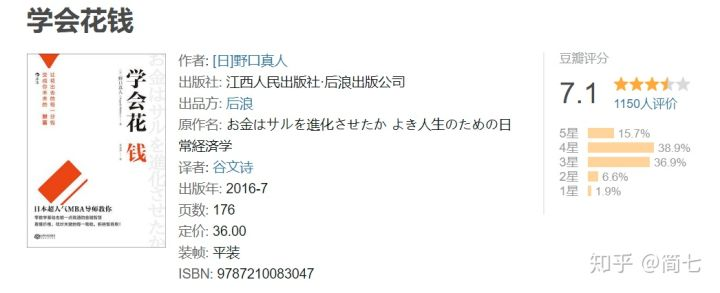
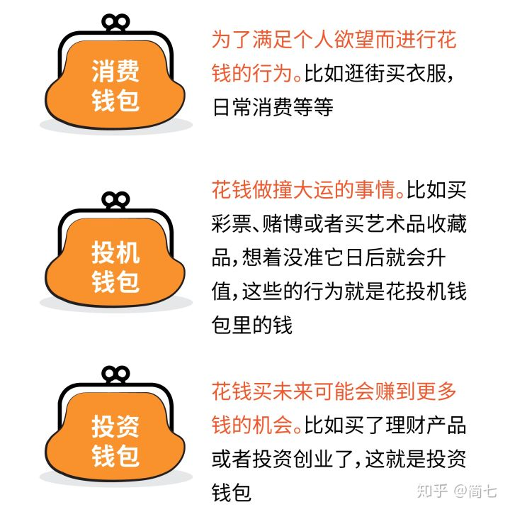
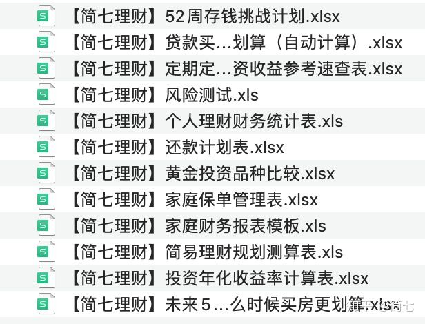

# 如何能避开花钱误区，把钱越花越多？

来自：[如何能避开花钱误区，把钱越花越多？](https://zhuanlan.zhihu.com/p/267290059)

---

不知道你是不是同意一个观点，赚钱不容易，花钱更是一门学问。怎么掌握花钱的分寸？面对生活中的不确定性，又该如何合理安排支出？ 

还有，你分得清消费和投资吗？比如，买健身卡是投资自己吗？彩票是不理性的投机，为什么还有那么多人买？如何把钱变为有价值的资产，而不是交智商税？ 

在消费主义盛行的当下，经常忙着买买买的你，可能多少都有想过这些问题。

今天来和大家聊一本书，名字就叫**《学会花钱》**。 

我们来看一看，作者是如何透过价格的表象看懂事物的价值，又如何能避开花钱误区，把钱越花越多。

## **01.区分三个“钱包”** 

比尔·盖茨曾经说过，“巧妙地花一笔钱和挣到这笔钱一样困难”。

关于这一点，这本书的作者发现，在花钱方面其实存在很大的误区，多数人认为会花钱，就是会省钱，买便宜货。量入为出，勤俭持家，是花钱之道。 

可是作者认为，真正会花钱要懂得区分三个钱包。

我们每个人都有三个钱包，**消费钱包、投机钱包和投资钱包**。

**总体来说，多用投资钱包，适度消费钱包，避免投机钱包，就是关于花钱要记住的第一件重要的事。**

## **02.只买以后会更值钱的东西**  

既然要多用投资钱包的钱，可是具体怎么用呢？这就是接下来我们要讨论的话题：**让钱越花越多的原则**。 

这个原则就是：**只买以后会更值钱的东西。** 

问题是：我怎么才能够知道我买的东西以后值多少钱呢？ 

大概最难的就是**估算价值，还要把他们折现**。在经济学家看来，几乎所有的价值都可以折算成金钱来比较。 

比如，你的工作非常需要你拥有流利的商务英语能力，而且一旦你的英语水平提高的话，每个月薪资或许能提高5000块。

这样的情况下，报一个为期一年的培训班需要5万块，好像是一笔挺划算的投资，因为它在未来能够给你带来更多的金钱回报。

这就是估算购买物品在以后的价值，能帮助你决定是否要花这个钱。

不过，只是这么估算的话，其实还是太简单，而且有一个漏洞。那就是**你这样估算出来的金额，往往是偏高的。**

因为你忽略了一个重要的因素，那就是**时间**。换句话说，**未来的钱是不如现在的钱值钱的。** 

**所以，你在花钱投资计算未来收益的时候，不能直接把未来可能赚的钱数和现在要花的金额做比较，而是要给未来的钱打一个折扣，这个折扣，经济学上就叫折现率。** 

这个道理听起来很简单，可是大多数人常常意识不到这个问题。

懂得折现率的概念你就知道，**越早拿到越多的钱，你的折现损失就越少。**更不要说你提前拿到钱还能做其他投资，带来额外的收益。 

除了考虑折现率以外，你还要考虑一个因素，那就是**要多久以后才能获得回报，而到那个时候，你想要的回报对你是不是还有同样大的意义。** 

如果告诉一个20岁的年轻人说，“你现在给我200万，30年后我给你1000万”，很多年轻人都是愿意的，因为对他们而言30年后他们才50岁，还有很多时间享受这个金钱。 

但如果你和一个80岁的老年人说同样的话，他可能不会答应你，他觉得自己可能时日无多，不想冒风险。 

这也是为什么，我们经常建议——

**人在年轻的时候，可以适当多配置一些股票类资产，承受风险波动的能力会比较强，一旦出现了亏损，也能有机会用时间和不断累积的经验把收益“等”回来。**

## **03.两个策略减少投资损失**  

我们在投资的时候很可能因为概率的错觉或者是判断习惯，导致投资失败，那有没有方法减少投资的损失呢？

为了确保投资稳健，规避风险，作者建议两个策略：**一个是组合投资策略，一个是期权策略。** 

组合投资策略，说白了就是**不要把所有的鸡蛋放在一个篮子里，以避免因为你的判断错误而导致倾家荡产**。这种理念大家可能已经很熟悉了。 

第二个策略就是使用期权。**期权的本质，就是事先规定，在一个约定的时间内，花一定的钱来买某种交易的权利。** 

比如，你去租房子，在签合约的时候，要交一个定金，4000块钱的房租你可能要10%，也就是400块钱的定金，这个定金其实就是一个期权。

实际上你等于花了400块钱，来买来一个未来的权利。

如果在接下来一个月的时间，你找到一个租金只需要3000块钱的房子，那么你就可以不要这400块钱了，你就有权利选择放弃这份交易。

在未来投资可能会失败的时候，这就是你给自己买的一项反悔的权利。

这个思路可以给我们一个很好的方向，就是在对投资结果拿不准的时候，你可以先花一点小钱，买这个投资机会的权利。

如果过一段时间，你觉得这个投资的机会不好或者有更好的机会，你可以不要这部分定金，去追求更好的选择，那生活中这个投资的风险就会极大地被化解。

好啦，这就是《学会花钱》这本书给我们传递的主要内容，有兴趣的话，可以去翻读一下这本书。

 如果你想学习如何理财，我们也有一份【简七原创12个理财工具包】赠送给你，私信''理财''领取吧~

---

【完】