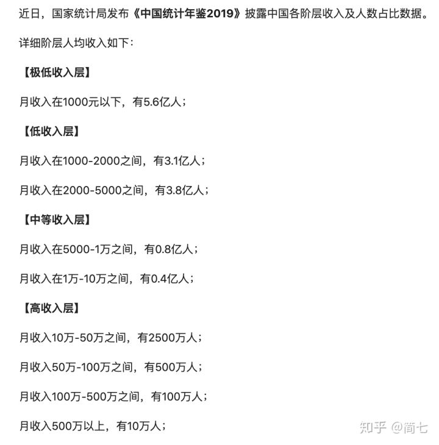
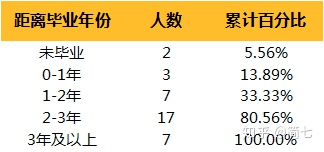

# 我很想知道，你们25岁有10万以上存款的人，是怎么办到的？真心求指教～？

来自：[我很想知道，你们25岁有10万以上存款的人，是怎么办到的？真心求指教～？](https://www.zhihu.com/question/268612781/answer/1499505320)

---

**说存款前，很想分享我最近看到的一些内容：**

包括18年被刷屏的文章：《摩拜创始人套现15亿背后,你的同龄人,正在抛弃你》。 

可以被鸡血，也可以作为自己奋斗的养料，但很想告诉你，不要无限放大焦虑，陷入到「**我不如同龄人甚至已经被后浪拍死的情绪中」。**

实际情况是：

**中国社会目前90%的人月收入在5000元以下；62%的人月收入在2000元以下；月收入过万的只有7110万人，仅占比约5%！** 

 所以我想把这句话说在前面：

## 一定要接受自己就是个普通人的事实。 

但普通不代表平庸，普通人也可以积极努力，可以活的很充实，每天充满奋斗的正能量。这点希望大家能达成共识。

我们曾经做过一个调查，什么时候拥有了自己的第一个10万。

其中有36个答案比较丰富，这些答案都来自30岁以下就拥有了自己第一个10万的简七小伙伴。

首先说明，并不是说30岁前收获10万是一个绝对的评判标准，我们绝对不希望视财如命地只关注数字。我们只是想透过这个调查，看到更多财务和生活的关系形态。

## 他们是怎么拥有第一个10万的？

## **秘密一：黄金3年**

 一个有趣的数字是，在我们调查的35个已攒够10万的小伙伴中，28个小伙伴是在毕业3年内第一次资产超过了6位数。

> 毕业3年，放银行卡一直没有关心，平时花费也不是很多，不知不觉到了10万。——白衣纪
> 毕业两年，靠工资+股票攒的。——饭饭

对于我们大部分人来说，毕业时才开始真正思考经济独立（不啃老）的问题。3年的长度，是个不错的初级赛道。

在这个初级赛道上，我们开始学习自己赚钱，花自己的钱，分配自己的钱。

如果毕业3年时，你既没有将钱用在投资自己之上，又没有存下第一桶金的话，或许是时候为财商多充一点余额了。

## **秘密二：人生节奏与财富节奏** 

另一个突破80%的数据是，关于10万的来源，80%的小伙伴的方法就是看起来最“老土”的储蓄。 

这不禁让我想到奇点的真相。

> 哎呀，我的10w好没有创意啊，就是毕业2年后，慢慢攒出来的——YY
> 刚毕业时工资不高，死逼自己拿出自己一半的工资存到新开的账户中，小三年才攒够10万。现在就好多了，会把工资分成几份来用，生活品质也比以前高了。——王洋

而关于10万的去处，也很有意思。 

除了理财投资，房子、车子也是不少人的选择。而投资副业、创业的比例也超乎我们的想象。

> 第一年基本没有攒钱，第二年攒了6w后买了车，然后第三年攒了6w后，又遇到了去年牛市，突破了10w。然后就买了房子。——东南
> 那10万刚好和朋友开了一家酸奶冰激凌店。生意不错。——Allen

不过，以下两个观点不少小伙伴都提了出来：

- 年轻的时候，总觉得花钱如山倒，挣钱如抽丝，好难呀。
- 有了第一个10万后，做事和做选择的底气，都足多了，也敢于做不同的尝试了。

其实，这一方面和我们一生的财富周期有关系，我们年轻的时候往往收入较少，但结婚、买房等重大支出却集中出现，压力大；

另一方面，年轻的我们往往有最好的试错机会，如果有了一定的财务保障，拼搏的动力也会更加强烈。 

无论如何，财富在任何时候，都更应该是顺应人生节奏的主力，而不是阻力。

尤其是充满无限可能的年纪。 

## **秘密三：守正与出奇**

接着上面的话题，财富和生活的最佳关系，其实就是守正出奇。

而所有答案中，最能将守正和出奇结合起来的，当属Allen的答案了。

Allen，29岁，教育背景良好，毕业后就进入了不错的律师事务所，毕业1年就有了10万元。总是，一路都是标准的别人家孩子，守正之路顺顺当当。

这时，Allen的好友邀请他开一家酸奶冰淇淋店。好友拿来了粗略的商业计划书，请他一起投资开店。

当时有一家国外的酸奶冰激凌店刚刚开始风靡，好友发现了商机，决定开一家更具本地特色的酸奶冰淇淋店与其对垒。

Allen和朋友兴致勃勃地与其商量起来，并决定充分利用认识几个当地名人的资源做些宣传。店开张后，由于口味更特别，性价比也比较高，加之时而有明星光顾，给Allen带来了不少额外收入。

第一桶金也越滚越大，直到第三年，铺子的主人见生意这么好加了双倍的房租，小店才戏剧性地关门了。

但Allen的“出奇”就此才算真正开始。有了投资开店成功的经历，Allen对商业产生了浓厚兴趣。

加上酸奶冰激凌店又让他小赚一笔，他终于在找到了合适的机会后，辞职和朋友开起了一家环保方面的高科技公司，一直经营至今。

Allen的生意和影响力越来越大，甚至做了当地商会的成员。

在还未找到合适自己的机会时，Allen利用自己的专业优势认真工作，积累了专业能力和财富；而发现自己非常想尝试的机会时，又利用之前积累的资源完成从律师到商人的转型。

同样的，我们还有小伙伴分享了自己边做公务员，边学习某一领域专业知识，并在社交平台分享、出书的经历。

而副业的收入，现在已经超过了本职工作，短短2年成为身边朋友中第一个攒到10万元的人。也是同样的道理。 

---

## 谈到这里，再跟大家分享一些对于储蓄干货，帮助大家早日存下第一个10万。

### **1.记账好处多**

记账，不见得能替你生钱，说到底也只是个工具。

只有持续的梳理和总结，才能替你回答：**钱都从哪儿来？都去哪儿了？**的问题。

这才是通过记账，大家需要去理清的部分。 

### **2.给生活定预算**

没有节制的开销，是「月光」的罪魁祸首。

当你把每月网购费用，限定为500元时，更能帮你想清楚，那些消费是真正必要的。 

## **攒钱4招** 

有了记账和预算的基础能力后，存钱大计就可以提上日程啦！

有哪些有效攒钱的方式呢？

### **1.用「定投」的方法强制储蓄**

**所谓定投，就是定时定额的存钱。**这也是我们测试下来，最简单有效的储蓄手段。

想想小时候，家里放个储蓄罐，一年下来总能积累一笔不小的财富，其实跟定投也是类似的道理。

对于上班族来说，我建议**从每月工资的10%开始存起**。

可以单独存入一张不绑定电子支付的银行卡，或者买一笔基金。

只要能让自己不轻易花掉，就迈出了存钱的第一步。

### **2.增加收入通道**

如果能在拥有一份稳定的全职工作之余，增加一份额外收入，岂不更好？

比如，通过理财的学习，为自己争取一份工作之余的收入，哪怕只是赚一笔零花钱，也是件美事。 

**毕竟，不积跬步无以至千里，每一笔小钱都值得认真对待。**

### **3.延长物品的使用寿命**

what？这也算攒钱吗？ 

还真算！

与其买得多，囤低价，不如添置些耐用好用的日常用品。 

衣服、家具、电器等都是如此，提高复用率，延长使用寿命，久而久之也能帮你省下不少钱！ 

### **4.第一个10万很重要**

其实，身边很多成功存下第一桶金的朋友都跟我回忆：大多数的钱都是靠「笨办法」存起来的

但心理的重大转变，大多都发生在账户上拥有第一个10万的时刻——“从那以后，你就不允许自己的存款，再低于这个数了”。  

## **花钱5法则**

### **1.避免冲动消费** 

我们都知道，冲动是魔鬼，但如何避免乱花钱和花错钱呢？可以分线上线下两个场景。

**-线上购物** 

喜欢先加购物车/收藏，给自己**至少3天的冷静期**，想清楚使用场景和频率。 

如果在这之后，还觉得自己很需要，那就大方付款吧。

**-线下购物** 

相信很多人都有过这样的经历，本来是想去超市买瓶洗发水，结账时却发现购物车里多了很多零食、饮料……

为了应对线下购物中的冲动，事前列清购物清单很必要。

另外，逛超市时，可以**多留意货架最上层和最下层的东西**，一般来说，它们质量也不错，但价格会便宜不少，性价比更高。

### **2.余额管理**

国庆假期马上来了，过后双11也快到了，各大网购平台又要合伙抢钱了！

很多人，受不住短信和推送的降价提醒，小手一滑，钱就没了。

我的建议是，**不要在支付宝、微信钱包里，放置大额现金。**

另外，对于实在控制不住自己的，花呗可以选择调低额度，多余的信用卡也可以做销卡处理。 

### **3.重返「纸币时代」**

电子支付真的会让人对花钱越来越“没感觉”。

如果你也有类似困扰，不如回归「纸币时代」，在日常消费中，可以取出一些纸币来付款，找回对真金白银的感觉。

### **4.抵制优惠券**

爱网购的人，常常被限额、限时的优惠券冲昏头脑。 

但想想，每年至少一次的618、双11、双12，其实大促一直有，根本没必要为了一时降价而血拼。

### **5.消灭“拿铁因子”**

拿铁因子是指，**每天一杯拿铁的小花费，日积月累也是大开销。**而这笔钱，往往并非必要。 

如果，你的生活中，也有戒不掉的蛋糕甜品，放不下的咖啡奶茶，不妨好好审视一下，这笔开销到底每月占比多大？

## **保障4底线**

### **底线1：预存保命金&生活备用金，绝不拿出来投资**

***所谓保命金，是3-5年的生活费。\***

***所谓生活备用金，是3-6个月的生活开支。\***

这些钱，都是为了应对生活中的意外事件，所准备的，切勿用来做高风险投资。

### **底线2：意外之财存起来**

意外之财？可不是彩票中奖。而是指非预期的钱，如奖金、股利分红、红包等等。

把这些钱，通通存起来，用于长线储备和投资，而不是买个包奖励自己，会是更好的理财之道。

### **底线3：朋友间借钱，只借自己认为“拿不回来也不要紧”的部分**

很多朋友因为钱最后翻脸，所以不要为了仗义而把大笔资金借出去，万一收不回来，伤财又伤感情。

### **底线4：保持高信用评分，不要拥有过多的信用卡**

等你要办贷款时，就知道自己的信用多么珍贵。 

持有越多信用卡，花钱的机会和欲望也越大，也更容易留下征信污点。

所以，减少持有的信用卡，按时支付账单，才能给自己的未来一份稳定的保障。

## **给负债者的5条清单** 

如果不幸，你不仅月光，还有负债，该如何合理应对，尽快还清呢？教你5招。

### **1.勇敢面对**

负债影响心态，而持续的压力下，甚至有人会走上歧途。

所以，你要做的第一件事，就是告诉自己：我虽然是个负债者，但依然有远大理想和目标，只要严格约束自己，总有一天能走出负债的状况。

### **2.清点负债数目和原因**

知道自己欠下的钱花去了哪里，比知道自己要还多少钱更重要。

拿出一张纸，逐条列出自己当前负债的条目和金额，再根据**《资产负债表》**，分类清点自己的存量财富情况和负债情况。 

### **3.制定消费计划**

使用《收入支出表》，搞清楚自己的消费上限究竟是多少，再给自己制定明确的消费计划。

### **4.制作每月还款明细表**

自己建一个表格，把自己的所有负债，逐项填进表格里，并规划每个月要还多少。

有了详细的计划，就能知道自己究竟哪天可以还完。一项项结束负债，会给自己的生活带来极大的信心。

**以上表格，我都为你准备好了，领取方法在链接中**：

[简七理财的12个原创工具包](https://link.zhihu.com/?target=https%3A//mp.weixin.qq.com/s/YfWwWE5yidvNjdXgrw_nLg)

作者：简七
链接：https://www.zhihu.com/question/268612781/answer/1499505320
来源：知乎
著作权归作者所有。商业转载请联系作者获得授权，非商业转载请注明出处。

### **5.坚持**

黑暗不可怕，可怕的是因为不知道光明何时到来，而丧失全部的热情。

如果你了解“复利”，就会知道“坚持”是投资者的一大利器。

心理学上有个荷花定律。

一个荷花池，第一天绽放的荷花很少，但是第二天，它们会以前一天的两倍速度绽放。

如果到第30天，荷花就开满了整个池塘。那么请问：第几天荷花开一半？

**你是不是也猜成第15天？答案是第29天。**

最后一天的绽放速度，等于前29天的总和。

**很多事情不是看到希望才去坚持，而是坚持了才会看到希望。**

我们也把存款干货的内容，浓缩成了一张清单送给大家~

有需要的同学，可以存在手机里，甚至打印下来贴在墙上，时时提醒自己，理财之路贵在坚持。

遮掉了一个二维码~

##  最后——

**“99%的人，都想过1%的人生——把拥有某个数字当做财务自由。然而，真正的自由，是拥有对金钱的把控力。”**

理财更简单，人生更自由！

看更多理财干货，欢迎关注我的知乎[@简七Jane7](https://www.zhihu.com/people/dfd9a5d840835ab24089f9c78ffb97b3)

