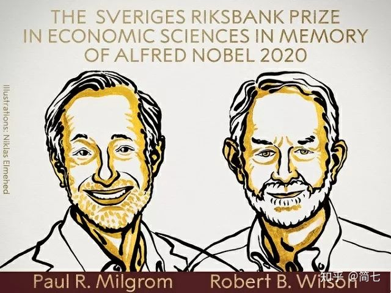
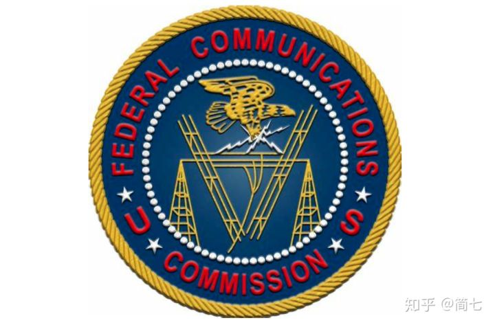
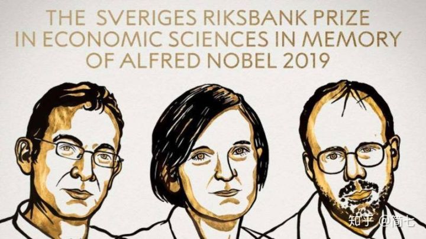
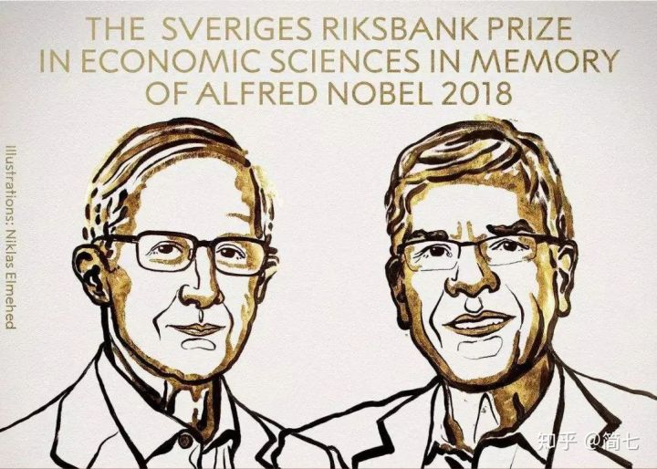
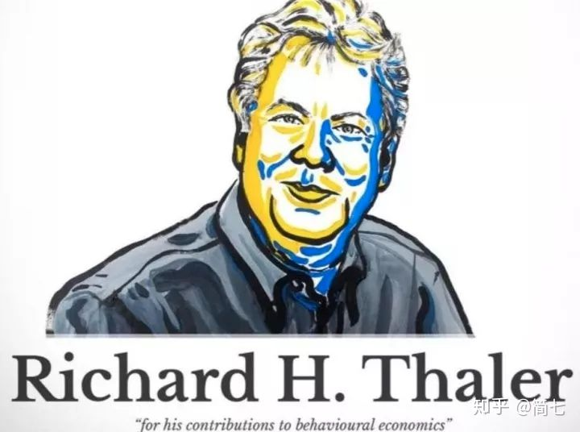
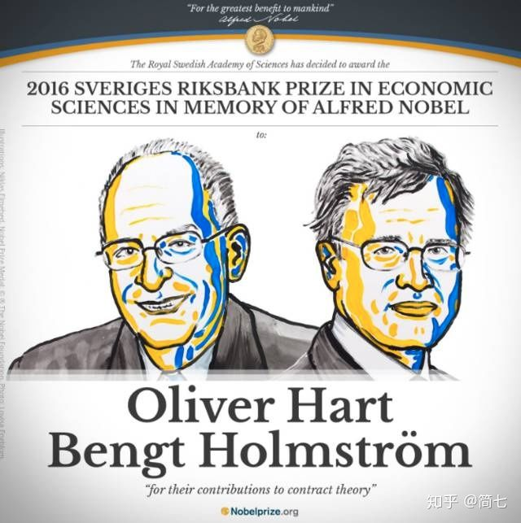

# 穷人为什么难以“翻身”？谈谈诺贝尔经济学奖那些与我们生活相关的研究|科普

来自：[穷人为什么难以“翻身”？谈谈诺贝尔经济学奖那些与我们生活相关的研究|科普](https://zhuanlan.zhihu.com/p/265614435)

---

**”2020年9月上海个人车牌最低价90600元“。**

生活在魔都的人，每个月都会收到这样一条新闻。你有没有好奇过，是谁这么聪明？发明了牌照“拍卖”？

他们是用那个小锤锤来拍卖吗？这不是很早以前就有了吗？

追溯起拍卖的起源，最早可以到**公元前5世纪的巴比伦，那个时候，拍卖的对象主要是人。**

日常的拍卖多数以“价高者得”这种形式在进行，这是传统的**“英式拍卖“**，事实上，拍卖还有很多其他的方式。

不仅如此，**拍卖的标的物也从人变成了实物**，包括古董字画这类有形资产，或者是油田开采权、无线频谱、广告位等公共资源。

比如你最熟悉的“上海牌照拍卖”，正是**通过发明的新的拍卖形式，解决复杂对象的分配问题。**

2020年诺贝尔经济学奖颁给了“拍卖理论”。

获奖者是自斯坦福大学的两位经济学家保罗·米尔格罗姆（Paul R． Milgrom） 和罗伯特·威尔逊（ Robert B）。这两位经济学家最重要的贡献，就是**设计了美国当局向电信运营商出售无线电频率的拍卖。**

我们每天用到的手机、电脑、电视这些机器，都需要通过无线电波来传输信号，而每种无线电波的频率却不同。

为了保证你在打电话的时候能同时上网，就需要确保无线电波互不干扰，所以需要将频率进行划分。

**作为通信运营商，想要提供通信服务，就必须有“频谱执照”。**但这项资源既是公有资源，又是私有资源的，所以，两位经济学家发明了一种全新的拍卖机制：

一次拍卖同时提供所有物品(比如，不同地理区域的无线电频段)，以低价开始，允许反复出价。

同时投标人的身份被保密，以避免报复性投标或串通压低价格，从而减少了不确定性和“赢家诅咒”所带来的问题。

“赢家诅咒”这个词，也源自于拍卖领域。

举例来说，如果我想拍卖一只古董花瓶。这个时候，1个人出1万元，1个人出10万元，最后，10万元赢得竞拍。

但事实上，这只花瓶按照“市场均价”来计算，可能只值5万元。

所以，**理性地来说，赢得竞拍的人反而要哭唧唧了。这就是赢家的诅咒。**

说回两位经济学家的贡献：

美国联邦通讯委员会试图用拍卖的方式来分配无线电频段，于是请到了这两位经济学家来设计许可证的拍卖机制。

最终，美国联邦通讯委员会在47轮竞标中出售了10张许可证，总价达6.17亿美元，而在此之前，政府是免费分配这些东西的。

因为这种拍卖机制所获得的成功，许多国家纷纷效仿，仅仅20年间，就为各国政府带来了超过1200亿美元的收益。

而现在，**这种拍卖机制也运用到了其他公共资源领域，比如电力、天然气等等**。

## **诺贝尔经济学奖5年巡礼**

借着这个机会，我也想和你一起回顾历届诺贝尔经济学奖的主要贡献，建议收藏。

**2019年**

阿比吉特·班纳吉 美国麻省理工学院

埃丝特·迪弗洛迈 美国麻省理工学院

迈克尔·克雷默  美国哈佛大学

 

在经济学家眼中，**真正的穷人，是指每人每天收入低于1美元的情况**。目前，**全世界约有10亿人，生活在这一贫困线以下。** 

为此，他们成立了一个“贫困行动实验室”，用科学方法，不仅找到了贫困的根源，还用实际行动，让一部分穷人的生活得到明显改善。

怎么做到的呢？这要先从贫穷的3个起因说起。 

**原因一：穷人缺乏信息，容易做出错误决定。** 

对我们来说，读书看报上网，都是我们获取信息的渠道。但真正的穷人们，可接触不到这些，也因此，他们获得的信息，是相对滞后和无效的。 

**原因二：忙碌和压力，蒙蔽了穷人的双眼**

班纳吉和迪弗洛在研究中却发现，穷人们一点儿也不懒，反倒比富人们更加勤奋和忙碌。但也正因为如此，在过度的压力和马不停蹄地工作中，他们越发无法破局，走入“越忙越穷”的恶性循环。 

**原因三：穷人对未来的悲观预期，导致难以存下钱。**

穷人想要存下钱，也比普通人的难度更大。于是，他们会想：既然离目标那么远，那还不如买杯茶呢。 

结果穷人的账单里，会有大笔诸如茶、零食一类能获得即时快感的消费，却不愿为未来储蓄。

**2018年** 

威廉·诺德豪斯 美国耶鲁大学

保罗·罗默 美国纽约大学

 

在经济发展的需求下，人们往往会忽视环境承载能力，低估环境破坏和生态破坏产生的不良后果。比如极端气候出现、全球变暖等等，背后都是大量大类活动带来的环境变化。

于是，诺德豪斯作为研究**“人类的经济活动如何影响自然环境”**的专家，建议解决温室气体排放问题的最高效方式是建立全球碳税机制，**奠定了“绿色GDP”核算的理论基础。**

再说说罗默。

过去，人们认为，只要技术能力上去了，那么生产效率一定可以提升。但事实上，世界上没有永动机，最好的机器也会有退休报废的那一天。 

所以，单纯靠机器是不行的，罗默提出，**特殊的知识和专业化的人力资本才是经济增长的主要因素。**

知识和人力资本上去了，才能实现整个经济规模的收益递增，从而保证经济的长期增长。

**2017年** 

理查德·H·塞勒 美国芝加哥大学

 2017年的诺贝尔经济学奖由芝加哥大学教授理查德·泰勒（Richard Thaler）一个人独得，获奖理由是他**对行为经济学的贡献。**

现在耳熟能详的许多“行为经济学”理论，都是泰勒提出的，比如： 

**1）沉没成本**

如果钱已经花出去了，并且无法收回，这些钱就是沉没成本。 

**2）禀赋效应** 

这个讲的是人们往往认为自己拥有的东西比较有价值，如果要卖给别人的话，也会要求比较高的价格。 

**3）心理账户** 

我们在心理上会为自己的钱分设不同的账户，每个账户的钱“专款专用”，这些不同的账户影响着我们日常决策。

比如你准备出门去看电影，可是在路上，出现了以下两种情况—— 

> 情况一：你发现丢了50元，你还会去电影院花50元看一场电影吗？
> 情况二：你发现花50元购买的电影票丢了，你还会重新花50元去看电影吗？ 

现实中大多数人选择情况一，而不是情况二。

但既然都是损失50元钱，如果丢了现金还去看，那么丢了电影票也应该看才对呀。这怎么解释？ 

这时“心理账户”就派上用场了。因为人们的内心有两个账户：**一个是现金账户，一个是电影票账户。** 

现金账户少了50元，不影响你继续看电影；但电影票账户少了50元，继续看电影就要再花50元，为了不让这个账户“超支”，你宁可放弃看电影。

**2016年** 

奥利弗·哈特 美国哈佛大学

本格特·霍斯特罗姆 美国麻省理工学院

 

你很可能会奇怪，“契约理论”和我有啥关系？仔细想想，我们现在时时刻刻都生活在契约中：

没有契约，大家只敢相信熟人（当然，也可能杀熟）；有了契约，陌生人之间也能建立起信任基础。 

说大一点，**现代文明正是靠着“契约精神”一步步发展起来的。**

16世纪的荷兰创造了公司、股票这些现代商业制度，并掌握当时世界商业的霸权，就是因为它最具有“契约精神”（说白了就是“诚信”）。 

而西方的“契约精神”不光在商业世界通行，甚至还上升到政治高度，比如卢梭的《社会契约论》揭示了公民与政府之间的隐性契约关系。 

说小一点，我们在淘宝上剁个手，都会用到契约呢！ 

所以，最近30年，契约理论这个经济学分支发展超快，就是因为“有用”。

大家就是想研究如何定好契约，如何实现各方利益平衡，减少契约（比如常见的“合同”）中的各种欺诈和陷阱，如何提高社会的运行效率……

每年诺贝尔经济学奖发布后我们都会做一波科普。

这个奖项不仅反映了经济学与现实世界的紧密联系，并且一直在不断地拓展经济学的边界，从而让我们**更好地理解人的动机、市场的规律、经济发展的机制。** 

突如其来的新冠疫情，不仅影响了人们的日常生活，同时重创了世界各地的经济。

在这个特别的年份，多名诺贝尔经济学奖获得者站了出来，积极地为疫情后经济复苏出谋划策。

危中有机，希望在经济学家们的引领下，**我们可以将这些原理在现实世界里找到合适的应用，最终拨开迷雾，走向胜利。**

看完这5年的诺贝尔经济学奖，来一起聊聊哪个理论令你最有收获吗？

- 理财更简单，人生更自由！
- 看更多理财干货，欢迎关注我的知乎[@简七Jane7](https://www.zhihu.com/people/dfd9a5d840835ab24089f9c78ffb97b3)

---

【完】