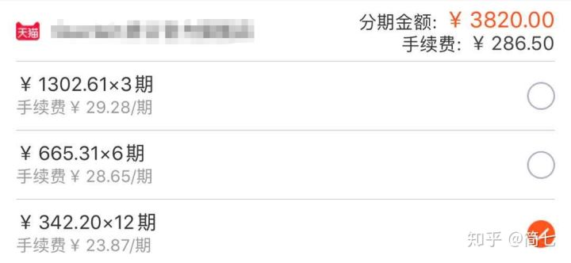
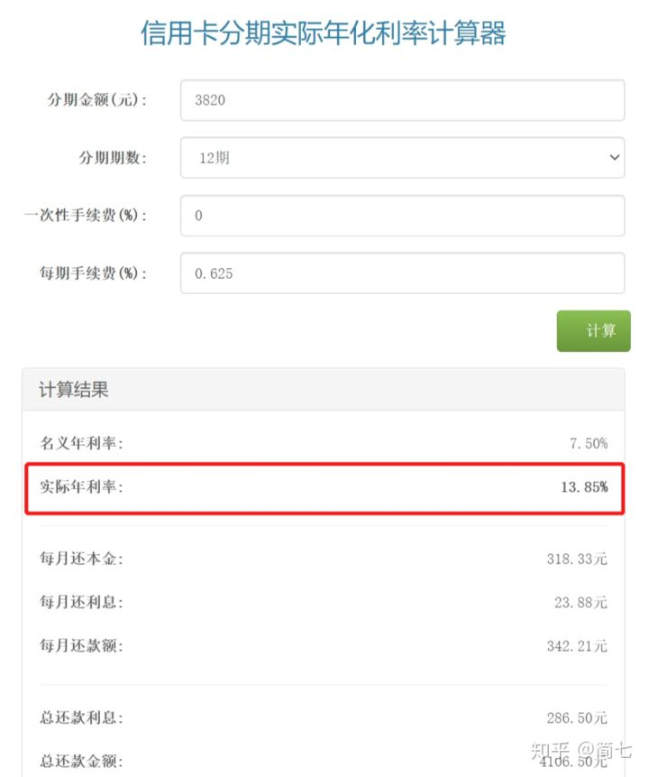
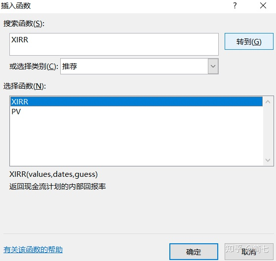
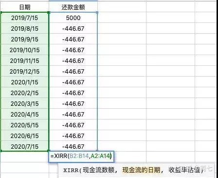

# 花呗分期的实际利率到底有多高？提醒你，双11马上要剁手了....

来自：[花呗分期的实际利率到底有多高？提醒你，双11马上要剁手了....](https://zhuanlan.zhihu.com/p/267673109)

---

大噶好啊，双11预售已经正式开启了，不知道小伙伴们有没有参加呢？

看到海量用户冲进了薇娅、李佳琦的直播间，听说光是定金就成交了10个亿。 

发出感慨的同时，还是要特别提醒你，千万不要透支消费。 

就说我自己吧，今年双11就只想干一件事：换一台手机。 

首先，我自己只有在满足以下两个条件时才会选择分期：

一是**全价买它没压力，哪怕不分期，我也完全能够买得起；**

二是**免息分期，没有任何分期利率和手续费，分期总金额和现在全价买的价格一样才考虑。** 

可惜，现在各种花式营销防不胜防，各种诱导大家往「恶性分期」的路上走：用高息分期，去买超过自己能力之外的东西。

### **01.花呗分期，是如何迷惑我们的呢？** 

我随手打开淘宝，给你举个例子。 

比如我现在看中一套3800块的化妆品，买起来有点心疼，但来个12个月分期，一个月还大概342块钱就够了，勉强还可以接受啊。 

一看，每个月就多付了23块的手续费，一杯咖啡的价格，感觉没啥。

**可事实上呢，你背上了一笔名义实际年利率高达13.85%的负债。** 

简单对比下，现在余额宝利率一直降，都不到2%了，这个利率高不高？

也许你会说，不对啊，不是分期手续费是每个月0.625%吗？

年利率不应该是0.625%×12=7.5%吗？

**这里就有一个常见的分期“障眼法”——我们每个月都会还掉一部分本金，但银行却永远按照最初的全额本金，每月收手续费。**

就说前面花了3820块买化妆品的案例，还到第12个月，我剩下的本金，只有318元了，但我这个月还是要多付23.87的手续费，**相当于月利率都有7.5%了。** 

所以，实际利率会比看起来的高不少，几乎翻了个倍。 

  我们的同事华华，几年前就曾经因为分期买了一张1万元的体检卡，吃了大亏。

### **02.分期付款，消费主义的“帮凶”** 

也许你会说，每个月才多了23块8毛钱，实际也没多少钱啊。

更可怕的一点，恰恰就在这里：**分期很容易麻痹你对合理消费的界限，轻易地选择高价消费。** 

第一个3800，你觉得有压力，你把它换成了每个月342元；

第二个3800来的时候，再多300多，好像也没什么。

原本3800的东西，你觉得买着有压力；

现在1万的东西，你可能也只会看到，分期1000多，好像还行。

之前知乎上也热烈讨论过一个话题，“消费主义是如何通过伪造文化来欺骗年轻人的”。**在很多案例中，分期付款也是一个“帮凶”。** 

越来越多的消费品，带上了“标签式绑架”：

- 你买了某奢侈品，就比别人品味高一等；
- 买了某潮牌，就代表你有个性；
- 钻石越大越纯净，就越爱对方……

社交媒体，热衷于分享明星/成功人士的生活方式，慢慢洗脑大家把“他们拥有”，等同于“你也需要”。

没错，虚荣心是人人都有的，但是，刻意放大人性中的这一面，还要包装成所谓的“低门槛”消费，搭配上“对自己好一些”的洗脑式营销，真的会让很多人在不知不觉中，陷入财务黑洞。

所以，希望你一定一定要注意，**不要因为分期好像压力小了，就轻易买一次付不起的东西！**

**事实上，分期绝不等于让自己简单拥有更好的东西。** 

**分期的本质，是向未来的自己借钱。** 

换个角度想，你会愿意给什么样的人借钱呢？会愿意借钱给TA买什么呢？ 

这么一想，是否要分期的答案，也就不难选了。

## 03.花呗分期的年化率如何算

这里要给大家介绍一个万能公式：**XIRR**。

XIRR公式不仅能用在像各类分期、贷款的实际利率计算，还能计算你的投资收益。不需要纸笔，只要电脑里装了excel就可以用。 

简单介绍一下XIRR的具体使用方法。

**第一步，收集每个月的还款明细，也就是每个月的固定还款。**

**第二步，在excel里，找到任意空白的两列，分别输入还款/投资金额和操作的对应日期。**

这里有2个注意点：

1）投入的金额为负数，收回的金额（或目前的金额）为正数；

2）日期的单元格格式，一定要使用日期格式。

**第三步，代入XIRR公式。**

以上信息都输入完整后，只要在任意空白格内，输入“=XIRR(投资金额区域，对应的日期区域)”。

第一列选中你的投资/还款明细，第二列选中全部日期，再按回车，实际收益率就算出来了。

这个公式非常实用，对任何借款渠道，建议都不妨用它来计算一下实际利率。

如果你不想设置，**可以私信【工具包】，免费发送给你**。

### **04.分期利率计算器**

如果Excel对你来说有点难理解，也可以百度搜索一下“分期利率计算器”，在网页中填入对应的数字的就可以了。 

还是举我们买化妆品的例子。

3820元的化妆品套盒，分12期付款，每期手续费需要23.87元。

所以，**每期的手续费=23.87/3820 ≈ 0.625%。**

在计算器中填入每期手续费0.625

在使用计算器时也有一个小提示，如果你是分期还款，那么填入每期手续费率就可以了。一次性手续费填入0。

如果是一次性支付手续费，操作也一样。

好了，今天的分享就到这里，老规矩，如果对你有用，不妨点个赞收藏起来~

文中提及的利率清算表格，私信【工具包】，免费领取哦~

---

【完】